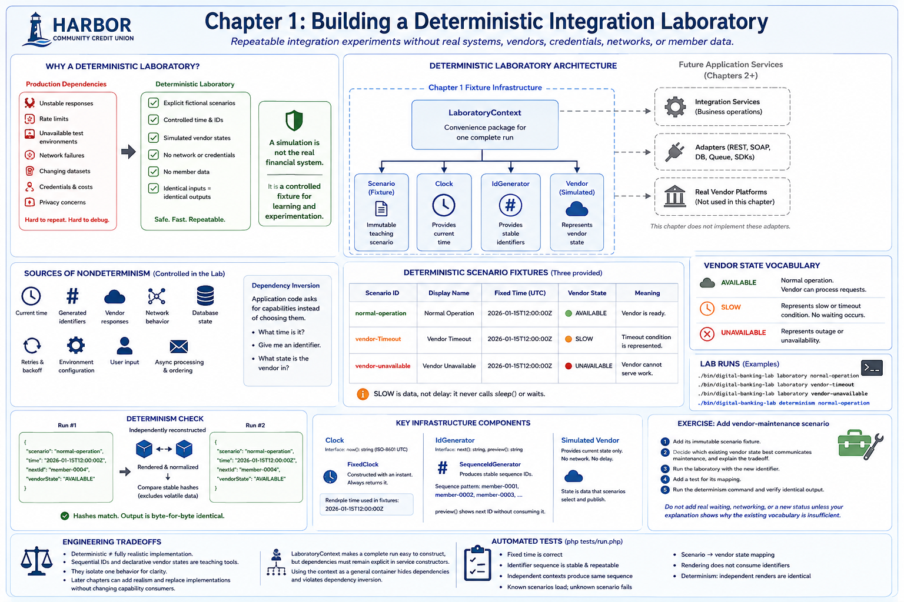

# Chapter 1: Building a Deterministic Integration Laboratory



## Educational question

How can we build a repeatable laboratory for experimenting with digital banking integrations without depending on real banking systems, vendor services, credentials, networks, or member data?

## Learning objectives

By the end of this chapter, you can explain the value of deterministic simulations, distinguish production infrastructure from laboratory infrastructure, create deterministic fixtures, control time and identifiers explicitly, represent simulated vendors, run repeatable scenarios, and verify that identical inputs produce identical outputs.

## Banking concept

Financial software commonly depends on core banking systems, digital banking vendors, identity providers, payment processors, and fintech services outside the application's control. Direct tests against them inherit unstable responses, rate limits, unavailable test environments, network failures, changing datasets, credentials, costs, and privacy concerns.

A deterministic laboratory replaces those dependencies with explicit fictional teaching scenarios. No scenario contains member information or contacts a vendor. That makes an integration condition reproducible without pretending that a simulation is the real financial system.

## Engineering concept

**Controlled nondeterminism** means supplying values that infrastructure would otherwise choose implicitly. Current time, generated identifiers, vendor responses, network behavior, database state, retries, environment configuration, user input, and asynchronous processing can all change an outcome.

Dependency inversion makes application code ask for capabilities—“What time is it?”, “Give me an identifier,” and “What state is the vendor in?”—instead of choosing the system clock, random UUID generator, or live API itself. Future chapters can supply HTTP, SOAP, database, queue, or vendor-SDK adapters behind such boundaries. This chapter deliberately does not implement those adapters.

## Architecture

The [deterministic laboratory diagram](../diagrams/deterministic-laboratory.md) separates the Chapter 1 fixture infrastructure from future application services. `LaboratoryContext` packages an explicitly constructed scenario, clock, identifier generator, and vendor for convenient inspection; it is not a general-purpose service locator.

## Implementation

`Clock` exposes only `now()`. `FixedClock` is constructed with an instant and always returns it. `IdGenerator` supplies stable identifiers, while `SequenceIdGenerator` produces `member-0001`, `member-0002`, and so on. Its preview operation lets reporting show the next value without consuming it. Production systems may instead require UUIDs or distributed identifier strategies.

An immutable scenario records its identifier, display name, fixed time, and description. The code-backed factory creates three complete contexts:

| Scenario | Vendor state | Meaning |
| --- | --- | --- |
| `normal-operation` | `AVAILABLE` | The vendor is ready. |
| `vendor-timeout` | `SLOW` | A timeout condition is represented. |
| `vendor-unavailable` | `UNAVAILABLE` | The vendor cannot serve work. |

`SLOW` is data, not delay: it never calls `sleep()` or waits. Later chapters can interpret the condition when teaching timeout behavior.

## Run the laboratory

```bash
./bin/digital-banking-lab laboratory normal-operation
./bin/digital-banking-lab laboratory vendor-timeout
./bin/digital-banking-lab laboratory vendor-unavailable
./bin/digital-banking-lab determinism normal-operation
```

The determinism command constructs two independent contexts, renders both, and compares stable SHA-256 hashes. It excludes current timestamps, random values, temporary paths, process identifiers, and environment-specific data.

## What to observe

Each run reports the same fixed time and next identifier. The scenario changes only the declared vendor status. Running one fixture repeatedly—or independently reconstructing it—produces byte-for-byte identical output. No credentials, network, database, live service, or actual member data participates.

## Engineering tradeoffs

**Deterministic does not mean realistic in every implementation detail.** Sequential identifiers and declarative vendor states would not necessarily be production choices. They intentionally isolate one behavior so a learner can reason about it. Later chapters can add realism while preserving deterministic execution and can replace these implementations without changing capability consumers.

The context makes a complete run easy to construct, but dependencies should remain explicit in future service constructors. Treating the context as a container from which arbitrary code fetches services would hide those dependencies and defeat dependency inversion.

## Automated tests

```bash
php tests/run.php
```

The dependency-free suite retains Chapter 0 tests and verifies fixed time, stable and independently repeatable identifier sequences, known and unknown scenario handling, scenario-to-vendor-state mapping, non-consuming rendering, and identical independent renders.

## Exercise

Add a `vendor-maintenance` scenario:

1. Add its immutable scenario fixture.
2. Decide which existing vendor state best communicates maintenance, and explain the tradeoff.
3. Run the laboratory with the new identifier.
4. Add a test for its mapping.
5. Run the determinism command and verify identical output.

Do not add real waiting, networking, or a new status unless your explanation shows why the existing vocabulary is insufficient.
