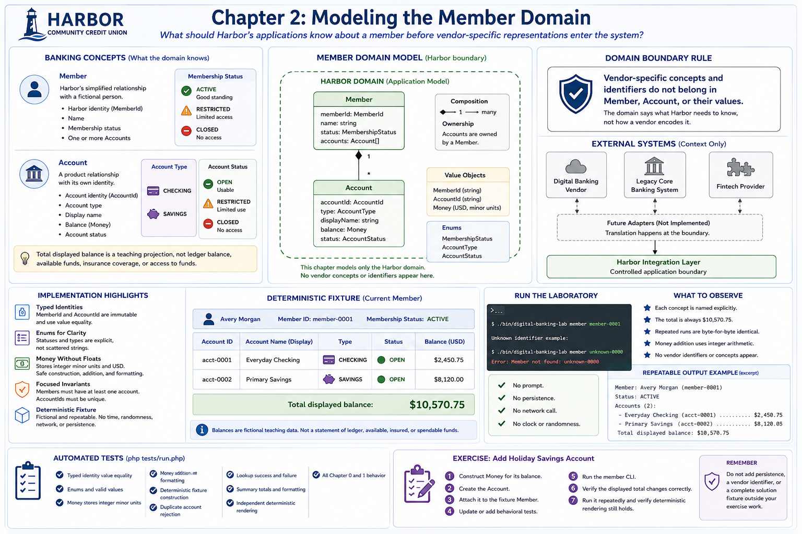

# Chapter 2: Modeling the Member Domain



## Educational question

What should Harbor's applications know about a member before vendor-specific representations enter the system?

## Learning objectives

By the end of this chapter, you can distinguish domain and vendor models, explain why external identifiers are not automatically domain identity, model members and accounts explicitly, represent money without floating point, use immutable values, enforce focused invariants, build deterministic fixtures, and explain boundary translation.

## Banking concept

A **Member** is Harbor's simplified relationship with a fictional person. It has Harbor domain identity, a name, membership status, and one or more **Accounts**. An Account is a product relationship with its own identity, type, display name, balance, and account status. **Membership status** describes the overall member relationship; **account status** describes one account. A **balance** is the monetary amount displayed for that account.

This application model is intentionally small. Real institutions have much more complex identity and name requirements and distinguish ledger and available balances, holds, pending transactions, ownership roles, beneficiaries, joint owners, many product types, and account restrictions. Those concepts establish this lesson's boundary; they are not implemented here.

The total displayed balance is only a teaching projection. It is not a statement of ledger balance, available or spendable funds, insurance coverage, or access to funds.

## Engineering concept

**Internal domain models should not be dictated by external system schemas.** A vendor may call identity `customerKey`, a legacy core may call it `MEMBER_NBR`, and a fintech may call it `user_id`. Harbor code still works with `MemberId`. Future adapters will translate those representations; Chapter 2 does not implement translation.

> **Domain boundary rule:** vendor-specific concepts and identifiers do not belong in `Member`, `Account`, or their values. The domain says what Harbor needs to know, not how a vendor encodes it.

## Architecture

The [member domain diagram](../diagrams/member-domain-model.md) shows object composition and the Harbor boundary. External systems and future adapters are context only and have not been implemented.

## Implementation

`MemberId` and `AccountId` are immutable typed identities with value equality. PHP enums make membership status (`ACTIVE`, `RESTRICTED`, `CLOSED`), account type (`CHECKING`, `SAVINGS`), and account status (`OPEN`, `RESTRICTED`, `CLOSED`) explicit rather than scattered strings.

`Money` stores integer minor units and explicit `USD` currency. Construction, addition, and formatting never convert to floating point. `Member` rejects an empty account collection and duplicate account identities. Account ownership is explicit through the member's account collection, and each Account requires identity, type, balance, and status.

The fixture is fictional and deterministic: Avery Morgan (`member-0001`) has Everyday Checking with $2,450.75 and Primary Savings with $8,120.00. The application renderer builds an intentional summary rather than exposing object internals. Domain objects do not know about CLI output.

## Run the laboratory

```bash
./bin/digital-banking-lab member member-0001
```

An unknown identifier produces a stable error and non-zero exit status. There is no prompt, persistence, network call, clock, or random value.

## What to observe

The summary names each concept explicitly and always ends with `Total displayed balance: $10,570.75`. Repeated construction and rendering are byte-for-byte identical. Addition happens through `Money`, not by parsing text or using a float.

## Engineering tradeoffs

USD-only money, a single string name, and direct account containment keep the lesson legible. Production requirements may warrant richer models. Adding them speculatively would obscure the boundary lesson. Validation covers emptiness and duplicates without elaborate identifier regexes or invented regulatory rules.

## Automated tests

```bash
php tests/run.php
```

The suite verifies typed identity, enums, integer money storage and arithmetic, stable formatting, fixtures, duplicate rejection, lookup failure, summary totals, independent deterministic rendering, and all earlier behavior.

## Exercise

Add a third deterministic account named **Holiday Savings** with an appropriate stable identifier and fictional balance:

1. Construct its `Money` value.
2. Create the `Account`.
3. Attach it to the fixture `Member`.
4. Update or add behavioral tests.
5. Run the member CLI.
6. Verify the displayed total changes correctly.
7. Run it repeatedly and verify deterministic rendering still holds.

Do not add persistence, a vendor identifier, or a complete solution fixture outside your exercise work.
