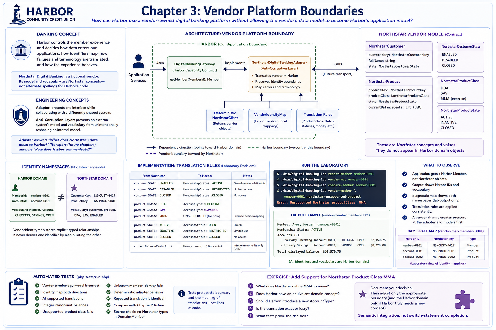

# Chapter 3: Vendor Platform Boundaries



## Educational question

**How can Harbor use a vendor-owned digital banking platform without allowing the vendor's data model to become Harbor's application model?**

## Learning objectives

After this chapter, you can distinguish Harbor and vendor models, define a Harbor-owned capability contract, translate vendor values, preserve separate identity namespaces, recognize an anti-corruption layer, test it deterministically, and locate the first pressure created by a vendor contract change.

## Banking concept

Financial institutions frequently depend on vendor-owned platforms. Harbor may control its member experience, custom application code, some databases, and some APIs while vendors control important platform capabilities. System ownership does not remove Harbor's responsibility for integration behavior. Harbor still decides how data enters its applications, how identifiers map, which capabilities are exposed internally, how failures and terminology are translated, and how the member experience behaves.

Northstar Digital Banking is a wholly fictional teaching vendor. It calls a person a `customer`, identifies one with `NS-CUST-4417`, calls accounts `products`, and uses values such as `DDA`, `SAV`, and `ENABLED`. Those are Northstar concepts—not alternate spellings to scatter through Harbor's code.

## Engineering concept

An **adapter** presents one interface while collaborating with a differently shaped system. An **Anti-Corruption Layer** prevents an external system's model and vocabulary from unintentionally reshaping an internal model. “Corruption” does not imply misconduct: it means model leakage. Northstar says `DDA`; Harbor says `CHECKING`. Northstar says `customerKey`; Harbor uses `MemberId`. The adapter translates.

Not every integration needs a large anti-corruption layer. Translation adds code and maintenance, but reduces coupling and localizes vendor change.

> **Adapter versus transport:** Chapter 3 teaches **integration semantics**. Future chapters teach **integration transport**. The adapter answers “What does Northstar's data mean to Harbor?” A future REST client answers “How does Harbor communicate with Northstar?” Combining those responsibilities now would hide the lesson behind HTTP details.

## Architecture

See the [vendor platform boundary diagram](../diagrams/vendor-platform-boundary.md). Dependency direction points toward Harbor's domain: the Harbor-owned `DigitalBankingGateway` returns `Member`, while its Northstar implementation depends downward on vendor records, a deterministic client, an identity map, and focused translation.

`member-0001` and `NS-CUST-4417` are not interchangeable. They belong to different identity namespaces. The same applies to `account-0001` and `NS-PROD-9001`. `VendorIdentityMap` stores explicit typed relationships; it never derives one identifier by manipulating the other.

## Implementation

Northstar's immutable contract model consists of `NorthstarCustomer`, `NorthstarProduct`, status/state enums, product-class values, and typed customer/product keys. `DeterministicNorthstarClient` returns objects rather than pretending an in-memory fixture is an HTTP response.

`NorthstarDigitalBankingAdapter` accepts a Harbor `MemberId`, resolves the Northstar key, fetches vendor data, maps every product key back to an explicit Harbor `AccountId`, and constructs Harbor values. The fictional rules are deliberately local:

| Northstar | Harbor |
|---|---|
| `ENABLED` | `MembershipStatus::ACTIVE` |
| `DDA` | `AccountType::CHECKING` |
| `SAV` | `AccountType::SAVINGS` |
| product `ACTIVE` | `AccountStatus::OPEN` |
| `currentBalanceCents` integer | `Money::usd(...)` integer minor units |

These are laboratory translation decisions, not universal banking definitions. Unknown `MMA` fails with deterministic `VendorTranslationException`; it is neither guessed nor leaked upward.

## Run the laboratory

```bash
./bin/digital-banking-lab vendor-member member-0001
./bin/digital-banking-lab vendor-map member-0001
./bin/digital-banking-lab compare-member member-0001
./bin/digital-banking-lab vendor-member member-0001 northstar-unsupported-product
```

The final command intentionally exits unsuccessfully with `Unsupported Northstar productClass: MMA`. It is developer-facing laboratory diagnostics; member-safe error handling belongs to a later chapter.

## What to observe

The normal command receives a Harbor member from a Harbor contract. Application output contains Harbor IDs and vocabulary, not Northstar keys or product classes. The diagnostic map alone displays both namespaces and labels itself as laboratory output. The comparison checks meaningful fields—identity, name, statuses, account order and identity, types, and integer money—rather than arbitrary object serialization.

A changed vendor representation creates pressure in Northstar models and translation first. Harbor's `Member`, `Account`, and enums remain unchanged unless Harbor makes a separate domain decision.

## Engineering tradeoffs

The explicit model, map, and translator require more types and tests than passing an array through the application. In return, invalid assumptions fail near their source, vendor changes have an obvious home, transport can change independently, and Harbor retains control of its language. A very small or stable integration might use a thinner adapter, but should still preserve the capability and identity boundaries.

## Automated tests

The dependency-free suite verifies vendor terminology, both mapping directions, all supported translations, integer-minor-unit balances, explicit unsupported-value and unknown-identity errors, deterministic rendering and repeated translation, meaningful equivalence with Chapter 2, and a focused source inspection ensuring `Domain/Member` contains no Northstar dependency.

```bash
php tests/run.php
```

## Exercise

Add support for fictional Northstar product class `MMA`—but **do not automatically map a vendor value simply because its name looks familiar**. Do not implement a switch case until you can answer:

1. What does Northstar define `MMA` to mean?
2. Does Harbor have an equivalent domain concept?
3. Should Harbor introduce a new `AccountType`?
4. Is the translation exact or lossy?
5. What tests prove the decision?

The exercise is semantic integration, not switch-statement completion. Document the decision, then adjust only the appropriate boundary (and the Harbor domain only if Harbor truly needs a new concept).
