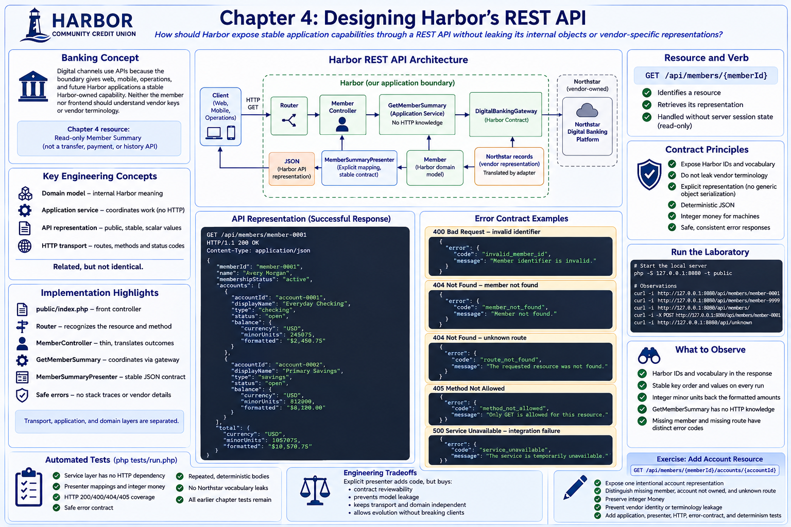

# Chapter 4: Designing Harbor’s REST API



## Educational question

**How should Harbor expose stable application capabilities through a REST API without leaking its internal objects or vendor-specific representations?**

## Learning objectives

After this chapter, you can identify a resource, select HTTP methods and status codes, distinguish domain models from API representations, separate controllers from application services, serialize deterministic JSON and integer money deliberately, preserve Harbor identity, define safe errors, and test application, representation, and transport layers independently.

## Banking concept

A member thinks, “Show me my accounts.” The technical path may be Member Web → Harbor API → application service → vendor adapter → vendor platform. Digital channels use APIs because the boundary gives web, mobile, operations, and future Harbor applications a stable Harbor-owned capability. Neither the member nor frontend should understand Northstar's customer keys, products, `DDA`, or `SAV`.

The Chapter 4 resource is a read-only **Member Summary**. It contains the Harbor member identity and a useful account summary. It is not a transfer, payment, authentication, transaction-history, or account-mutation API.

## Engineering concept

Four related concepts have different jobs:

- The **domain model** expresses internal Harbor meaning, such as `MembershipStatus::ACTIVE` and integer-minor-unit `Money`.
- The **application service**, `GetMemberSummary`, coordinates the Harbor-owned `DigitalBankingGateway` without knowing HTTP.
- The **API representation** intentionally maps the result to public scalar values, such as `"status": "active"`.
- The **HTTP transport** turns a route and method into `200 OK` and JSON (or a safe error).

Thus domain `MembershipStatus::ACTIVE`, API value `active`, HTTP `200 OK`, and JSON `"status": "active"` are connected, but not identical. Generic object serialization would make private structure, enum implementation choices, and later refactors accidental parts of the public contract.

REST is used pragmatically here. `/api/members/member-0001` identifies a resource; `GET` retrieves its representation; status codes describe the transport outcome; each request is handled without server-side session state. Future mutation workflows make method choice even more important, but Chapter 4 remains read-only.

## Architecture

See the [Harbor REST API diagram](../diagrams/harbor-rest-api.md). The request flows through router → thin controller → transport-independent application service → Harbor gateway. The return path crosses vendor representation → adapter → Harbor `Member` → explicit API presenter → JSON. This keeps vendor, domain, and API representations visibly separate.

## Implementation

`public/index.php` is the front controller. The tiny `Router` recognizes one resource shape and distinguishes an unsupported method from an unknown route. `MemberController` obtains the identifier, calls `GetMemberSummary`, and translates known outcomes; it does not read fixtures, translate vendor records, or calculate balances.

`MemberSummaryPresenter` defines stable key order and explicit mappings for membership status, account type, and account status. It exposes only Harbor IDs. Money has `currency`, integer `minorUnits`, and a deterministic `formatted` teaching aid. Minor units are authoritative for machines because integers avoid floating-point rounding ambiguity; clients must not parse or calculate from the formatted display string.

Every failure uses `{"error":{"code":...,"message":...}}`. An invalid domain identifier is `400`; a missing member is `404 member_not_found`; an unrecognized route is the distinct `404 route_not_found`; and a known route with a non-GET method is `405`. Unexpected integration failures become an API-safe `500 service_unavailable`, never an exception name, stack trace, path, or vendor detail. Chapter 5 and later failure chapters can refine that policy.

## Run the laboratory

Start PHP's local server (no internet or dependencies required):

```bash
php -S 127.0.0.1:8080 -t public
```

In another terminal, observe each contract outcome:

```bash
curl -i http://127.0.0.1:8080/api/members/member-0001
curl -i http://127.0.0.1:8080/api/members/member-9999
curl -i http://127.0.0.1:8080/api/members/
curl -i -X POST http://127.0.0.1:8080/api/members/member-0001
curl -i http://127.0.0.1:8080/api/unknown
```

## What to observe

The successful body always has the same keys, ordering, accounts, and balances: `$2,450.75` and `$8,120.00`, backed by integer values `245075` and `812000`. It contains `member-0001`, not a vendor customer key. Repeat the request and compare bodies: no clock, random request ID, or environment value changes the contract.

Notice where HTTP stops: `GetMemberSummary::execute(MemberId)` receives no request and returns no response. A CLI or test can call it directly. Notice also that a missing member and missing route share an HTTP status but have distinct error codes and meanings.

## Engineering tradeoffs

An explicit presenter and small transport types add code compared with `json_encode($member)`. They buy contract reviewability, prevent vendor/internal leakage, make formatting intentional, and let domain structure evolve separately. The router is deliberately limited rather than a home-grown framework. A mature service may justify framework routing and middleware later, but Chapter 4 needs none and adds no dependency.

The service translates the known adapter identity miss into `MemberNotFound`. Other vendor failures are contained by the HTTP boundary but not exhaustively classified; detailed vendor failure translation belongs later.

## Automated tests

```bash
php tests/run.php
```

Application tests inject the Harbor gateway and prove the service needs no HTTP or fixture knowledge. Presenter tests compare a readable contract fixture and inspect mappings, integer money, formatting, and absence of vendor language. HTTP tests cover 200/400/404/405, content type, account content, error shape, safe failures, and repeated deterministic bodies. All earlier chapter tests remain in the same suite.

## Exercise

Add (but do not look for a solution in this chapter):

```text
GET /api/members/{memberId}/accounts/{accountId}
```

Expose one intentional account representation. Decide how nesting communicates member/account ownership; distinguish a missing member, an account not owned by that member, and an unknown route; preserve integer `Money`; and prevent vendor identity or terminology leakage. Add application, presenter, HTTP, error-contract, and determinism tests. Do not query Northstar fixtures or build vendor objects in the controller.
