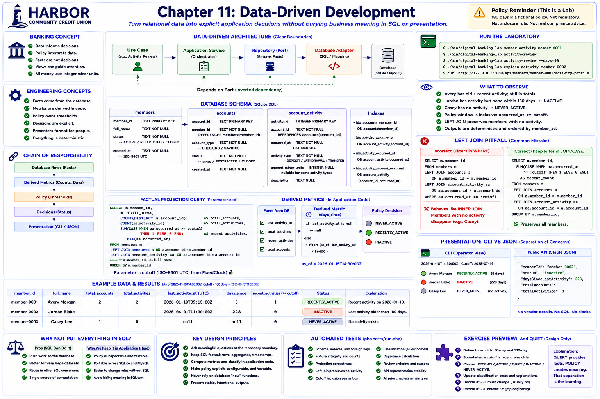

# Chapter 11: Data-Driven Development



## Educational question

**How should Harbor turn relational data into explicit application decisions without burying business meaning inside SQL queries or presentation code?** Chapter 10 retrieved relational facts correctly. This chapter asks what Harbor chooses to do with them.

## Learning objectives

After this chapter, you can distinguish retrieval from interpretation; create factual projections and derived metrics; define explicit, deterministic rules; keep SQL factual and presentation representational; test thresholds; and build stable operational summaries.

## Banking concept

Digital banking software uses data to decide what to display, which operational records merit attention, which workflows apply, and where follow-up may be relevant. Data does not decide by itself: application policy interprets it. Member activity is the fictional example here.

> **Policy warning:** 180 days is a fictional educational policy. It is not a regulatory dormancy threshold, account-closure rule, escheatment rule, fraud indicator, or creditworthiness measure. `INACTIVE` is a Harbor laboratory classification, not a universal banking or compliance definition. The review list does not recommend contacting, restricting, or closing an account.

## Engineering concept

The chain is deliberately visible:

```text
Database rows -> Facts -> Derived metrics -> Policy -> Decision -> Presentation
```

For example, latest activity `2025-06-01`, as-of `2026-01-15T14:30:00Z`, and 228 whole elapsed days are different kinds of meaning. With the 180-day policy the application decides `INACTIVE`; the CLI may then present an activity-review candidate.

### Facts versus decisions

| Value | Type |
|---|---|
| Last activity timestamp | Fact |
| Recent activity count | Fact/aggregate |
| Days since last activity | Derived metric |
| 180-day threshold | Policy |
| `INACTIVE` | Decision |
| “No activity within the current window” | Explanation |

`MemberActivityFacts` contains only database facts. Days since activity is `floor(elapsed seconds / 86,400)` in application code. `ActivityPolicy` owns the threshold. `ClassifyMemberActivity` owns three inspectable outcomes: zero total rows is `NEVER_ACTIVE`; at least one row at or after the inclusive cutoff is `RECENTLY_ACTIVE`; otherwise it is `INACTIVE`.

## Architecture

See the [data-driven development diagram](../diagrams/data-driven-development.md). The repository is a Harbor-owned port. Neither PDO nor SQL enters the use cases, and neither classification nor querying enters a presenter.

## Implementation

The aggregate query counts distinct accounts, all activities, conditionally counted recent activities, and the maximum timestamp. Its cutoff is parameterized. The `LEFT JOIN`s retain members whose accounts have no activity.

### The LEFT JOIN pitfall

Suppose Avery has activity and Casey does not. This shape preserves both members:

```sql
FROM members m
LEFT JOIN accounts a ON a.member_id = m.member_id
LEFT JOIN account_activity aa ON aa.account_id = a.account_id
```

Recent activity is counted with `CASE WHEN aa.occurred_at >= :cutoff`. Moving that predicate into `WHERE aa.occurred_at >= :cutoff` rejects Casey's null joined row, making the outer join effectively an inner join. The chosen inclusive boundary is **`occurred_at >= cutoff`**.

### Why not put everything in SQL?

SQL can return `CASE ... THEN 'INACTIVE'`. That may be sensible for reporting, very large analytical workloads, or performance-sensitive aggregation. It is not inherently wrong. Here, application-side classification keeps the policy inspectable, tests simple, and dialect dependence low. Changing policy therefore need not change SQL when the factual projection already contains sufficient evidence.

## Run the laboratory

```bash
./bin/digital-banking-lab member-activity member-0001
./bin/digital-banking-lab activity-review
./bin/digital-banking-lab activity-review --days=90
./bin/digital-banking-lab explain-activity member-0002
```

The API exposes `GET /api/members/{memberId}/activity-profile`. It uses the fixed laboratory instant and an explicit presenter; there is no public multi-member review endpoint.

## What to observe

* Avery has old and recent rows, but all rows remain in the total.
* Jordan has activity but none in the 180-day window and is `INACTIVE`.
* Casey remains in the projection with zero counts, a null timestamp, and `NEVER_ACTIVE`.
* Review output is ordered by member identifier and explains qualification.
* A new policy instance changes the cutoff without mutating global state.

## Engineering tradeoffs

The aggregate query is efficient and portable enough for this laboratory, while date arithmetic remains in PHP. A richer analytics platform could optimize classification near the data, but would require an explicit ownership and consistency tradeoff. This chapter introduces neither scoring nor machine learning: every outcome is traceable to facts and a rule.

## Automated tests

The executable suite covers projections, null-preserving joins, cutoff inclusion, policy cutoffs, all classifications, elapsed-day calculation, review reasons and order, API representation and 404 behavior, architecture boundaries, and Chapters 0–10 regressions.

## Exercise

Add `ActivityClassification::QUIET` without implementing a generic rules engine:

1. Make 30-day and 180-day thresholds explicit in policy.
2. Define exact inclusive boundary semantics.
3. Classify activity within 30 days as `RECENTLY_ACTIVE`, 31–180 days as `QUIET`, older activity as `INACTIVE`, and no activity as `NEVER_ACTIVE`.
4. Update classification tests and CLI explanations.
5. Decide whether the SQL query must change and justify the answer.

The intended insight is that the factual query may already provide enough information; a new decision does not automatically require new SQL.
