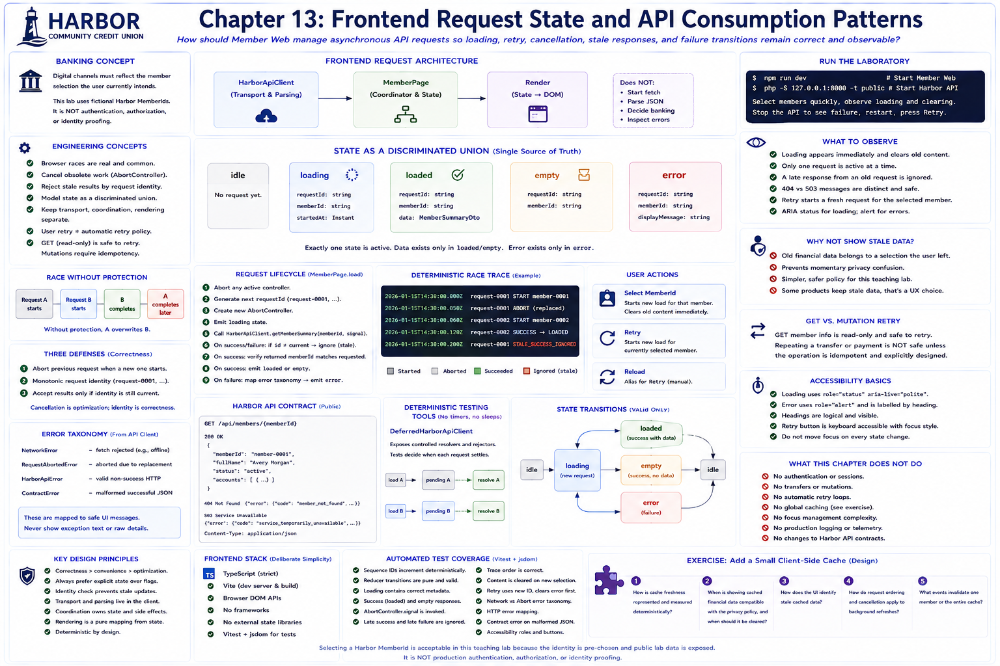

# Chapter 13: Frontend Request State and API Consumption Patterns



## Educational question

**How should Member Web manage asynchronous API requests so loading, retry, cancellation, stale responses, and failure transitions remain correct and observable?**

## Learning objectives

After this chapter, you can model request state explicitly; identify browser races; cancel obsolete work; reject stale results by request identity; distinguish user retry from an automatic retry policy; choose deliberately whether previous data remains visible; test promises without clock delays; separate transport, coordination, and rendering; and explain why retrying a read-only GET differs from retrying a mutation.

## Banking concept

A financial interface must reflect the member selection the user currently intends, not whichever network call happens to finish last. Otherwise a late response can briefly show the wrong selected member, a previous account, or data from an outdated request. This is ordinary asynchronous correctness with an especially clear privacy consequence; it does not require sensational claims.

Chapter 13 deliberately clears previously rendered financial information as soon as another laboratory member is selected. Some products keep stale data visible during refresh. Here, removal is the safer and clearer teaching policy because the old information belongs to a selection the user has left. This is a UX decision, not a universal rule.

The selector contains fictional Harbor MemberIds and makes transitions observable. It is not authentication, authorization, or identity proofing.

## Engineering concept

The race is simple:

```text
Request A starts
       ↓
Request B starts
       ↓
B completes
       ↓
A completes later
```

Without protection, A overwrites B. Member Web uses three defenses: a new request aborts the prior `AbortController`; a monotonic `RequestSequence` assigns `request-0001`, `request-0002`, and so on; and completion code compares the completing identity with the active identity. B therefore stays authoritative even if a fake or alternative transport lets A complete.

### Cancellation versus stale-result protection

Cancellation is an optimization and control mechanism: it tells `fetch` that obsolete work is no longer useful. Request identity is the correctness mechanism: it prevents any obsolete completion from changing state. Cancellation can arrive too late, and test doubles may ignore signals, so attempting cancellation never removes the need for the identity check. An abort caused by replacement is expected control flow and does not become a member-facing failure.

### A state machine rather than unrelated flags

Independent fields can permit a contradiction such as:

```text
isLoading = true
hasError = true
member != null
```

The `MemberPageState` discriminated union instead permits `idle`, `loading`, `loaded`, `empty`, or `error`. Every non-idle variant carries request metadata; data exists only in loaded/empty and an error exists only in error. `reduceMemberRequestState` is pure and refuses success or failure events whose identity/member selection does not match the active state.

### Errors and retry

Transport mechanics remain in `HarborApiClient`. A rejected browser fetch becomes `NetworkError`; a cancellation becomes `RequestAbortedError`; valid non-success HTTP responses remain `HarborApiError`; and a malformed successful body remains `ContractError`. Rendering maps these distinctions to safe wording and never prints JavaScript exception text.

Retry is user initiated and travels through the same coordinator as selection. It targets the currently selected MemberId, obtains a fresh request identity, clears error content with `loading`, then finishes in loaded/empty/error. There is no automatic retry loop. `GET` member information is read-only and naturally safe to request again. Repeating a future command such as “Transfer $500” requires careful idempotency design, so this chapter implements no mutation.

## Architecture

See the [frontend request-state diagram](../diagrams/frontend-request-state.md). `HarborApiClient` owns HTTP and parsing, `MemberPage` coordinates requests and emits state, and `renderMemberPage` only maps state to DOM. Account-card rendering never starts a request.

## Implementation

`RequestSequence` is frontend-local and deterministic; it is not a backend correlation ID. `MemberPage.load` aborts any active controller, records the abort and start in `RequestTrace`, emits loading, invokes the signal-aware API client, and accepts only a current result. It additionally checks that the returned Harbor `memberId` matches the requested member.

The trace is test/laboratory output and is not put into normal member-facing markup. The deterministic race reads:

```text
request-0001 START member-0001
request-0001 ABORT
request-0002 START member-0002
request-0002 SUCCESS
request-0001 STALE_SUCCESS_IGNORED
```

`DeferredHarborApiClient` exists in tests. It exposes controlled resolve/reject functions, so tests choose completion order without `setTimeout`, sleeps, a live API, or scheduling guesses.

## Run the laboratory

Start the Harbor API from the repository root, then Member Web in a second terminal:

```bash
php -S 127.0.0.1:8080 -t public
cd apps/member-web
npm install
npm run dev
```

Open `http://127.0.0.1:5173`. Load `member-0001`, select `member-0002`, and quickly select another member. Observe that loading replaces account content. To exercise failure without backend sleeps, stop the local PHP server, make a selection, restart it, and press Retry. The automated controlled-promise test is the deterministic race laboratory; no delay-only backend behavior is added.

## What to observe

* The labelled selector always represents the current fictional MemberId.
* Every selection or Retry displays “Loading member information…” and removes prior balances.
* Only one request is active; starting another aborts its predecessor.
* A late predecessor cannot render success or error.
* Missing-member and temporary-service messages remain distinct and safe.
* Loading uses status/live semantics, error uses alert semantics, and Retry remains a keyboard-accessible button. Rendering does not move focus on each state change.

## Engineering tradeoffs

The controller keeps one listener because this application has one page root. A larger application might support multiple observers. A reducer makes transition invariants independently testable without introducing Redux or a frontend framework. The trace is deliberately in memory rather than a member-visible debug panel. The page clears old financial data rather than providing stale-while-revalidate; the exercise demonstrates why adding caching expands the state space.

Automatic retries need context: failure type, delay/backoff, connectivity, user expectations, load amplification, and operation idempotency. This chapter intentionally offers one explicit, user-initiated retry for a GET.

## Automated tests

Run:

```bash
cd apps/member-web
npm test
npm run typecheck
npm run build
cd ../..
php tests/run.php
```

Vitest covers deterministic IDs, reducer purity, loading metadata, successful and empty responses, abort signaling, late success/failure rejection, trace order, content clearing, Retry identity, network versus abort taxonomy, HTTP errors, malformed successful JSON, safe UI wording, selector labeling, status/alert semantics, and account rendering. Backend tests confirm that the Harbor member contract remains unchanged.

## Exercise: add a small client-side cache

Implement a cache keyed by Harbor MemberId without implementing mutations. A cached selection may render immediately and start a background refresh, but neither cached data nor a refresh result may overwrite a newer request. Every refresh must still obey request identity.

Document and test your answers:

1. How is cache freshness represented and measured deterministically?
2. When is showing cached financial data compatible with the privacy policy, and when should it be cleared?
3. How does the UI identify stale cached data?
4. How do request ordering and cancellation apply to background refreshes?
5. What events invalidate one member or the entire cache?

Caching increases state complexity: specify whether cached financial data is shown, why that choice is appropriate, and which union variants are needed before writing code. A solution is intentionally not included.

The natural objective for Chapter 14 is **digital self-service workflows and form validation**. It will build on this request boundary; Chapter 13 does not implement it.
