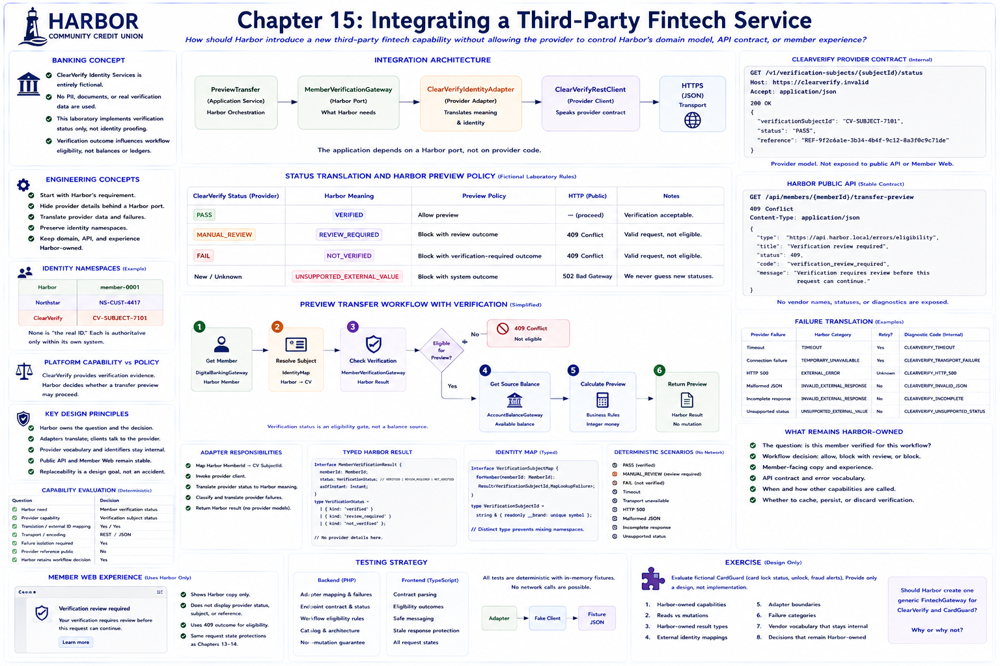

# Chapter 15: Integrating a Third-Party Fintech Service



## Educational question

How should Harbor introduce a new third-party fintech capability into an existing member workflow without allowing the provider to control Harbor's domain model, API contract, or member experience?

## Learning objectives

After this chapter, a learner can place a new service behind a Harbor-owned port; evaluate capability fit; preserve identity namespaces; model REST data; translate statuses and failures; compose a workflow; and test the boundary without a network.

## Banking concept

Financial institutions frequently add specialized capabilities such as identity verification, account opening, fraud tooling, personal financial management, card controls, and payments. That does not mean every capability should be outsourced. The useful questions are **does the provider capability fit Harbor's need?** and **how can Harbor integrate it without surrendering its architecture?** ClearVerify Identity Services is entirely fictional and is not a model of a specific real product. No PII, documents, or real verification data are used.

## Engineering concept

The design sequence is:

> Harbor requirement → Harbor-owned port → provider evaluation → provider adapter → provider client/transport

Starting with “the vendor has API X, therefore Harbor's domain becomes X” reverses dependency ownership. `MemberVerificationGateway` asks Harbor's question. `ClearVerifyRestClient` speaks the provider contract. The adapter is the only semantic translation point.

### Platform capability versus application policy

This distinction is central. ClearVerify supplies verification evidence/status. Harbor decides whether transfer preview may proceed. The laboratory rules are:

| ClearVerify evidence | Harbor meaning | Harbor preview policy |
|---|---|---|
| `PASS` | `VERIFIED` | allow |
| `MANUAL_REVIEW` | `REVIEW_REQUIRED` | block with review outcome |
| `FAIL` | `NOT_VERIFIED` | block with verification-required outcome |

These are fictional laboratory rules, not universal mappings or regulatory guidance. A new provider status fails as `UNSUPPORTED_EXTERNAL_VALUE`; Harbor never guesses. The eligibility blocks use HTTP **409 Conflict** because the request is structurally valid but conflicts with the member's current workflow eligibility. They are not amount validation errors.

### Identity namespaces

One person can have identifiers in several system namespaces:

- Harbor: `member-0001`
- Northstar: `NS-CUST-4417`
- ClearVerify: `CV-SUBJECT-7101`

None is “the real ID.” Each is authoritative only in its own namespace. Dedicated typed maps prevent a Northstar customer key, Heritage account number, ClearVerify subject, and Harbor identifier from becoming an ambiguous string map.

### Member-experience ownership

Bad member copy is “ClearVerify returned MANUAL_REVIEW.” Stable Harbor copy is “Your verification requires review before this request can continue.” Provider status, subject, diagnostic reference, and operational diagnostic code stay outside public API and Member Web. Harbor could replace the adapter without rewriting the browser contract.

## Architecture

See the [third-party fintech integration diagram](../diagrams/third-party-fintech-integration.md). `PreviewTransfer` depends on three focused ports and never imports provider code. The composition root selects the adapter.

## Implementation

The fictional contract is `GET /v1/verification-subjects/{subjectId}/status` at `https://clearverify.invalid`. The response contains `verificationSubjectId`, provider `status`, and an internal diagnostic `reference`. `ClearVerifyRestClient` constructs and validates HTTP/JSON and creates vendor models; it never constructs a Harbor result. The adapter maps identity and meaning into `MemberVerificationResult`.

Deterministic fixtures cover pass, review, fail, instant timeout, unavailable transport, HTTP 500, malformed JSON, incomplete response, and unsupported status. Failures map respectively into Harbor `TIMEOUT`, `TEMPORARY_UNAVAILABLE`, `EXTERNAL_ERROR`, `INVALID_EXTERNAL_RESPONSE`, and `UNSUPPORTED_EXTERNAL_VALUE`, with internal `CLEARVERIFY_*` diagnostics.

The capability evaluation is deterministic:

| Question | Decision |
|---|---|
| Harbor need | Member verification status |
| Provider capability | Verification subject status |
| Translation / external identity mapping | Yes / Yes |
| Transport / encoding | REST / JSON |
| Failure isolation required | Yes |
| Provider reference public | No |
| Harbor retains workflow decision | Yes |

Evaluation asks more than “can we call it?” It examines fit, identifiers, translation, failures, exposed data, switching cost, experience ownership, and decision ownership.

## Run the laboratory

```bash
./bin/digital-banking-lab verification member-0001
./bin/digital-banking-lab verification member-0002 --scenario=verification-review
./bin/digital-banking-lab verification-diagnostic member-0001
./bin/digital-banking-lab fintech-evaluation clearverify
./bin/digital-banking-lab architecture-check
```

The diagnostic command intentionally exposes provider details to laboratory engineers; public HTTP and Member Web do not.

## What to observe

Observe where `PASS` becomes `VERIFIED`, that balance lookup occurs only after verification eligibility, that successful preview JSON remains unchanged, and that the browser knows only `verified`, `review_required`, or `not_verified`. Separate cancellable member and verification reads share request identity protection, so an obsolete response cannot overwrite the selected member.

## Engineering tradeoffs

The extra port, typed identity, models, and translation add code, but constrain switching cost and failure blast radius. A 409 eligibility outcome is more expressive than field validation. Harbor deliberately does not persist verification data, execute transfers, retry automatically, or expose provider diagnostics.

## Automated tests

Backend tests verify request construction, parsing, mapping, failure taxonomy, endpoint privacy, workflow blocks, catalog ordering, architecture, non-mutation, and Chapters 0–14 regression. Frontend tests and TypeScript checks cover contract parsing, Harbor copy, eligibility errors, and stale-request protections. All transports are fixture-backed and cannot open a live connection.

## Exercise

Evaluate, but do not implement, fictional **CardGuard**, which offers card-lock status, card unlock, and fraud-alert status. Produce:

1. Harbor-owned capabilities;
2. which capabilities are reads versus mutations;
3. Harbor-owned result types;
4. external identity mappings;
5. adapter boundaries;
6. failure categories;
7. vendor vocabulary that remains internal;
8. decisions that remain Harbor-owned.

Should Harbor create one generic `FintechGateway` for ClearVerify and CardGuard? Why or why not? The expected lesson is to reuse the ports-and-adapters pattern—not invent a meaningless universal interface.
