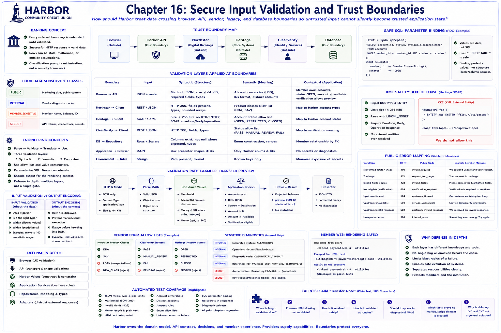

# Chapter 16: Secure Input Validation and Trust Boundaries



## Educational question

How should Harbor treat data crossing browser, API, vendor, legacy, and database boundaries so untrusted input cannot silently become trusted application state?

**Every external boundary is untrusted until validated.** This is not an accusation that a vendor is malicious. Data can be malformed, stale, corrupted, incompatible, manipulated, or merely outside Harbor's assumptions.

## Learning objectives

After this chapter, you can identify full-stack trust boundaries; separate syntactic, semantic, and contextual validation; use allow lists; validate browser and vendor JSON/XML; explain SQL parameter binding; safely display plain text; minimize sensitive diagnostics; and explain defense in depth.

## Banking concept

Financial applications process member-sensitive information while depending on browsers, vendors, legacy platforms, databases, and configuration. The browser is outside the backend boundary. Northstar, Heritage, and ClearVerify are outside Harbor's application boundary. A successful HTTP response does not validate its payload, and a database row may still be stale or invalid.

Harbor uses four modest teaching classifications: `PUBLIC` (marketing title), `INTERNAL` (vendor diagnostic code), `MEMBER_SENSITIVE` (member name or balance), and `SECRET` (API token). Classification is a prompt to minimize exposure, not an enterprise governance framework.

## Engineering concept

The safe sequence is **Parse → Validate → Translate → Use**, not **Parse → Trust**. Northstar JSON is parsed, checked for fields/types and allow-listed enums, made into Northstar types, and translated. A browser transfer request is parsed, shape-checked, converted through Harbor IDs and `Money`, checked against application state, and only then produces a preview.

Validation has three layers:

1. **Syntactic:** does JSON parse, is `minorUnits` an integer, is the SOAP element present?
2. **Semantic:** are account IDs distinct, is currency USD, is an external status supported?
3. **Contextual/application:** does the member own the account, does verification permit the workflow, is the amount within available balance?

Canonical Harbor value constructors provide one identifier rule rather than controller-specific regexes. Browser checks remain supplemental.

### Input validation versus output encoding

For a plain-text memo `<b>Rent</b>`, validation asks whether it is a string within 140 characters. It need not delete `<` or `>`. Output encoding asks how those characters are displayed rather than interpreted as markup. Member Web escapes dynamic strings before its controlled template reaches the DOM, so `<b>Hello</b>` remains visible text. Validation protects domain expectations; contextual output encoding protects the rendering context.

## Architecture

See the [trust-boundary diagram](../diagrams/trust-boundaries.md).

| Boundary | Input | Main validation |
|---|---|---|
| Browser → API | JSON and route values | method, media type, 64 KiB limit, shape, Harbor values |
| Northstar → client | JSON | HTTP status, fields, types, bounded products, enums |
| Heritage → client | SOAP/XML | 256 KiB limit, reject DTD/entities, `LIBXML_NONET`, envelope/body/operation/fault |
| ClearVerify → client | JSON | fields, types, subject match, status allow list |
| DB → repository | rows/scalars | mapping, expected types, enum construction |
| Application → browser | Harbor JSON | intentional presenter, runtime DTO validation, encoded DOM text |
| Environment → infrastructure | strings | explicit configuration and secret minimization |

## Implementation

`TrustBoundaryDescriptor` is immutable educational metadata. `DataSensitivity` names the four classifications without pretending to be a security framework.

### Request boundary and status codes

Transfer preview orders checks deliberately: HTTP method, `application/json` media type, a 64 KiB body limit, JSON parsing, shape, Harbor values, then application policy. `400` means malformed JSON/shape, `413` means too large, `415` means unsupported media, and `422` means a parsed request contains invalid values. HTML-looking memo text is accepted when it satisfies the plain-text contract.

### Vendor allow lists and JSON safety

Northstar product classes (`DDA`, `SAV`), ClearVerify statuses (`PASS`, `MANUAL_REVIEW`, `FAIL`), and Heritage account statuses (`OPEN`, `RESTRICTED`, `CLOSED`) are converted using enums. Unknown values fail explicitly; there is no “anything except closed is open” fallback. HTTP 200 alone never establishes validity. Required strings and integer minor units are checked, and Northstar's deterministic product collection is bounded.

### Parameterized SQL

Repositories use `WHERE member_id = :member_id` and bind the value. A suspicious-looking value remains data, unlike concatenating it into SQL source. Binding protects values, not dynamic table names, columns, or sort directions; any future dynamic SQL structure needs a small explicit allow list.

### XML security

XXE means XML External Entity. A resolving parser can be induced to read local or network resources. Heritage needs neither DTDs nor entities, so the client rejects `DOCTYPE`/`ENTITY`, limits response size, and parses with `LIBXML_NONET`. It then requires the SOAP Envelope, Body, operation response, and fields. This is proportionate structure checking, not full schema validation.

### Sensitive diagnostics and public errors

Operators normally need the integration, operation, failure category, and stable diagnostic code. They do not need the Authorization header, token, raw request, complete JSON/XML, or member balance. Harbor failure objects use explicit fields; public mappers omit diagnostic codes and return stable language. Secrets must not appear in normal CLI output, public responses, Member Web, exceptions, or snapshots.

API JSON includes `X-Content-Type-Options: nosniff`. The development CORS policy allows only `http://127.0.0.1:5173`, never `*`. These controls are defense in depth, not comprehensive browser security.

## Run the laboratory

```bash
./bin/digital-banking-lab trust-boundaries
./bin/digital-banking-lab validation-path transfer-preview
./bin/digital-banking-lab security-check
composer test
cd apps/member-web && npm test
```

## What to observe

The validation-path output distinguishes boundary validation from Harbor application rules. `security-check` says **Laboratory security checks: PASS**, not “the application is secure.” Vendor identifiers stay inside adapters; public DTOs contain Harbor identifiers only.

## Engineering tradeoffs

The limits are small deterministic teaching controls, not capacity planning. Explicit validation is repetitive but auditable. Frontend encoding preserves useful text instead of destructive “sanitization.” XML schema validation and generic recursive redaction would add complexity without improving this lesson's central model.

## Defense in depth

Frontend validation improves usability; the API independently validates transport and request shape; value objects preserve domain assumptions; application services check current state; repositories map data; and adapters distrust external responses. No layer replaces another. Passing these checks is neither a penetration test nor a production-security, compliance, or threat-model claim.

## Automated tests

Backend tests cover media type, size, malformed identifiers, injection-shaped values, safe public output, XML declarations, deterministic metadata, vendor enum failures, and all earlier regressions. Frontend tests prove HTML-looking member/account values remain literal text and no element is created, while prior request-state, Retry, verification, and transfer tests remain intact.

## Exercise

Add (but do not implement now) a plain-text **transfer note** limited to 500 characters. Decide: (1) where length validation occurs, (2) whether HTML-looking text is preserved, (3) how rendering stays safe, (4) how runtime API validation works, (5) whether the note belongs in diagnostics, (6) which tests prove no markup/script element is created, and (7) why deleting `<` and `>` is not a general solution.
