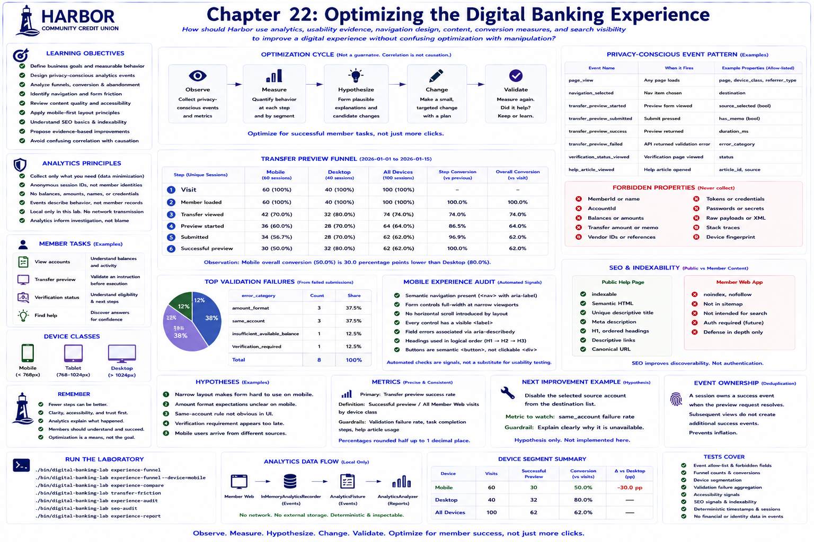

# Chapter 22: Optimizing the Digital Banking Experience



## Educational question

How should Harbor use analytics, usability evidence, navigation design, mobile-first principles, content, conversion measures, and search visibility to improve a digital experience without confusing optimization with manipulation?

## Learning objectives

After this chapter, you can distinguish business goals from measurable behavior; define privacy-conscious events; calculate funnels, conversion, abandonment, and device segments; identify navigation and form friction; review content, accessibility signals, mobile layout, and SEO fundamentals; and propose evidence-based improvements without treating correlation as causation.

## Banking concept

Digital banking engineering is not finished when an API returns 200. Navigation can be unclear, forms can create avoidable errors, a narrow layout can be awkward, internal terminology can confuse members, and useful help can be hard to discover. Harbor therefore adopts one product principle: **Optimize for successful member tasks, not merely for more interaction.** Fewer steps may be better. A useful outcome is an account view, a valid transfer preview, an understood verification block, or discovered help—not simply another click.

## Engineering concept

Use **Observe → Measure → Hypothesize → Change → Validate**, not **Measure → assume cause → change everything**. The fixture observes lower mobile preview conversion. Possible explanations include layout friction, intent, traffic source, device constraints, sample composition, or other factors. Analytics identifies **where to investigate**, not necessarily **why it happened**. Evidence could include layout inspection, validation categories, moderated usability work, and eventually a controlled experiment.

A proper A/B test needs defined variants and assignment, a primary metric, guardrails, enough observations, and disciplined interpretation. This laboratory does not implement experimentation or claim statistical significance.

## Architecture

The [digital experience optimization diagram](../diagrams/digital-experience-optimization.md) separates local safe events and analysis from member tasks. The analytics fixture never shares the banking activity database and never sends a network request.

**Analytics should describe behavior without reproducing member financial records.** `transfer_preview_validation_failed` with `error_category=amount_format` is useful. A member name, MemberId, AccountId, amount, balance, memo, provider ID, reference, or credential is forbidden. Anonymous `session-0001` identifiers, explicit device classes, allow-listed names, and event-specific properties make that boundary executable.

## Implementation

### Funnel and conversion

The transfer funnel is Visit → Member loaded → Transfer viewed → Preview started → Submitted → Successful. Each count is unique sessions. This chapter's overall conversion denominator is all Member Web visits; device conversion uses visits in that device segment. Step conversion uses the immediately preceding step. Percentages round half up to one decimal place, and a zero denominator yields `0.0%`.

Drop-off is diagnostic, not automatically bad: a member may intentionally stop. The deterministic window is 2026-01-01 through 2026-01-15. Its 100 fictional sessions include 60 mobile sessions with 30 successes and 40 desktop sessions with 32 successes. That difference is an observation, never an application-generated causal claim.

### Navigation and steps to task

Member Web exposes Accounts, Transfer Preview, and Help in `<nav aria-label="Member navigation">`. `navigation_selected` records destination only. Event sequences can count relevant navigation/actions before success; a future review may report average steps rounded to one decimal. This intentionally avoids replay, fingerprinting, and surveillance. Members should understand where they are, what they can do, and how to reach a task.

### Friction and hypotheses

Eight fictional failures aggregate to three `amount_format`, three `same_account`, one `insufficient_available_balance`, and one `verification_required`. No transfer value or memo is needed. One `ExperienceHypothesis` can state the observation, a plausible explanation, proposed change, metric, and guardrail. For example, disabling a selected source in destination choices may reduce same-account failures, while the guardrail requires explaining why it is unavailable. It remains a hypothesis and is not implemented by the chapter.

### Mobile, accessibility, content, and performance

The deterministic audit checks semantic navigation, full-width narrow form controls, absence of intentional fixed-width overflow, labels, field-error association, headings, and semantic buttons. These signals improve usability—especially keyboard and assistive navigation—but automated checks do not prove accessibility or replace human usability testing.

Rule-based content review asks whether wording states what happened, avoids vendor jargon and blame, supplies a next step where appropriate, and distinguishes preview from execution. `CLEARVERIFY MANUAL_REVIEW` fails those rules. “Your verification needs review before you can continue. No funds have been moved.” is Harbor-owned and clearer.

Performance awareness begins with requests and payloads rather than premature concurrency: the current member load makes one summary request and one verification request; preview makes one POST. A fixture-size threshold could teach payload awareness, but it would not be a production SLA.

### SEO and indexability

Public informational content can benefit from discoverability. Member financial pages generally should not be indexed. Member Web therefore carries `noindex,nofollow` as defense in depth—not as authentication or access control—while **Understanding Transfer Previews** is a public semantic page with a useful title, description, canonical path, one H1, ordered headings, and descriptive link text.

Search ranking depends on external factors. The SEO audit verifies implementation basics and indexability decisions; it neither predicts nor claims ranking improvement and does not encourage keyword stuffing.

## Run the laboratory

```bash
./bin/digital-banking-lab experience-funnel
./bin/digital-banking-lab experience-funnel --device=mobile
./bin/digital-banking-lab experience-funnel --device=desktop
./bin/digital-banking-lab experience-compare
./bin/digital-banking-lab transfer-friction
./bin/digital-banking-lab experience-audit
./bin/digital-banking-lab seo-audit
./bin/digital-banking-lab experience-report
php tests/Experience/run.php
cd apps/member-web && npm test
```

Open `/help/transfer-preview.html` from Member Web to inspect public content. Browser events remain only in `InMemoryAnalyticsRecorder`; event ownership records one success when the request resolves and does not depend on rendering.

## What to observe

Identify the selected denominator, the largest step drop, the device percentage-point difference, and the tied friction categories. Confirm reports contain neither financial values nor causal language. Compare vendor status `MANUAL_REVIEW` with Harbor-owned wording. Inspect the narrow layout manually: automation cannot judge whether a real member understands it.

## Engineering tradeoffs

Code-backed fixtures are transparent and deterministic but are not production telemetry. An allow-list gives up arbitrary analysis context to make minimization reviewable. A small Harbor-specific funnel avoids a premature generic platform. No real analytics vendor, advertising technology, replay, fingerprint, or internet transmission is introduced. SEO protection is defense in depth. Optimization must never become a dark pattern or reduce clarity and accessibility.

## Automated tests

Backend tests cover deterministic IDs/sessions/timestamps, allow-lists, forbidden properties, ordered step counts, conversions, abandonment, zero denominators, segmentation, percentage-point observations, friction, audit caveats, and SEO caveats. Frontend tests cover safe start/failure/success events, deduplication, and absence of form/member/vendor values. Existing backend, integration, security, API-data, delivery, and frontend suites remain regression gates.

## Exercise

Observation: mobile users have a lower transfer-preview success rate than desktop users.

1. Restate it without causal language.
2. Inspect each mobile funnel step.
3. Inspect validation-failure categories.
4. Propose three plausible hypotheses.
5. Select one low-risk improvement without implementing it.
6. Define the precise metric and denominator to watch.
7. Define a clarity, accessibility, or task-success guardrail.
8. List sensitive data that must not be added to analytics.
9. Define frontend instrumentation and experience tests.
10. Explain what evidence is required before claiming improvement.

The exercise assesses analytical reasoning, not click maximization. Chapter 23's natural objective is **the complete end-to-end digital banking integration laboratory**; it is not implemented here.
