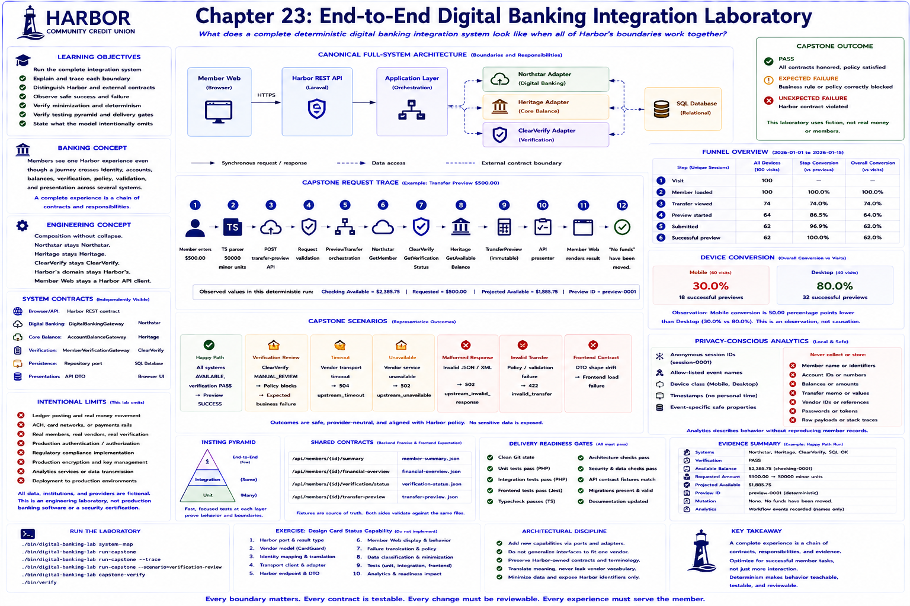

# Chapter 23: End-to-End Digital Banking Integration Laboratory



## Educational question

> What does a complete deterministic digital banking integration system look like when all of Harbor's application, integration, data, frontend, security, testing, and delivery boundaries work together?

## Learning objectives

Run the system from a clean checkout; explain and trace its frontend, API, application, SQL, and vendor dependencies; distinguish Harbor and external contracts; observe safe success and failure; verify minimization, determinism, testing, and delivery evidence; and state what the model omits.

## Banking concept

The member experiences one Harbor service even though a transfer preview needs Harbor identity, Northstar accounts, Heritage available balance, ClearVerify verification, request validation, frontend state, and member-safe errors. A complete experience is a chain of contracts and responsibilities, not one application.

## Engineering concept

**Composition without collapse.** Northstar remains Northstar, Heritage remains Heritage, ClearVerify remains ClearVerify, Harbor's domain remains Harbor's, and Member Web remains a Harbor API client. The capstone orchestrator calls established public application services; it neither replaces nor copies their rules.

## Architecture

Use the [canonical full-system diagram](../diagrams/end-to-end-digital-banking-laboratory.md). The browser/API, vendor, legacy, fintech, persistence, and presentation contracts are independently visible and surrounded by engineering controls.

| Boundary | Harbor side | External/other side |
|---|---|---|
| Browser/API | Harbor REST contract | Member Web |
| Digital banking | DigitalBankingGateway | Northstar |
| Core balance | AccountBalanceGateway | Heritage |
| Verification | MemberVerificationGateway | ClearVerify |
| Persistence | Repository port | SQL database |
| Presentation | API DTO | browser UI |

## Implementation

`EndToEndLaboratory` sequentially invokes member summary, financial overview, activity profile, verification, and preview services with fixed time and deterministic transports. Its immutable result contains Harbor outcomes and allow-listed analytics names only—never JSON/XML payloads, credentials, vendor IDs, or SQL rows. `CapstoneOutcome` separates `PASS`, correctly contained `EXPECTED_FAILURE`, and a violated Harbor contract (`UNEXPECTED_FAILURE`).

## Capstone request trace

```text
Member enters $500.00
↓ TypeScript string parser: 50000 minor units
↓ POST Harbor transfer-preview API
↓ PHP request validation
↓ PreviewTransfer
↓ DigitalBankingGateway → Northstar
↓ MemberVerificationGateway → ClearVerify
↓ AccountBalanceGateway → Heritage
↓ Harbor TransferPreview
↓ API presenter
↓ Member Web
↓ “No funds have been moved.”
```

## Run the laboratory

```bash
./bin/digital-banking-lab system-map
./bin/digital-banking-lab run-capstone
./bin/digital-banking-lab run-capstone --trace
./bin/digital-banking-lab run-capstone --scenario=verification-review
./bin/digital-banking-lab capstone-verify
./bin/verify
```

See the [walkthrough](../docs/capstone-walkthrough.md) and [test matrix](../docs/capstone-test-matrix.md).

## What to observe

Avery Morgan has checking and savings; checking digital/ledger/available values are `$2,450.75`, `$2,450.75`, and `$2,385.75`. A `$500.00` preview projects `$1,885.75`. Two freshly composed runs both begin at `$2,385.75` and use `preview-0001`: preview computes a value and mutates no state. Analytics records workflow names but no amount, memo, balances, identities, or diagnostics.

With ClearVerify review, transport succeeds and provider `MANUAL_REVIEW` is valid. The adapter translates it to `REVIEW_REQUIRED`; Harbor policy blocks preview and member-facing wording remains Harbor-owned. An unsuccessful business workflow is not necessarily infrastructure failure. Timeout, unavailable, malformed-response, invalid-transfer, and frontend-drift scenarios similarly prove safe classification.

## Full testing pyramid

Unit tests isolate behavior. Integration tests collaborate across real local components. Frontend tests verify TypeScript/UI behavior. Capstone tests verify whole deterministic process composition. The manual browser journey verifies the visible experience. None eliminates production testing, monitoring, or observability.

## Engineering tradeoffs

### Determinism versus realism
Controlled fixtures provide reproducibility but cannot reproduce every network behavior.

### Explicit architecture versus code volume
Ports and adapters make ownership clear at the cost of more structure.

### Data minimization versus debugging convenience
Raw payloads are convenient but increase exposure; the lab favors controlled diagnostics.

### Sequential orchestration versus concurrency
Sequential flow is teachable and deterministic; production may optimize latency differently.

### Simplified banking model
The model intentionally omits ledger posting, real money movement, ACH, card networks, production authentication/authorization, real members/vendors/verification, compliance implementation, production encryption/key management, analytics services, and deployment. It is not production banking software or a security/compliance certification.

## Automated tests

`tests/Capstone/run.php` proves composition, Harbor identity preservation, exact money values, no mutation, reset IDs, fixed time, minimized analytics, expected representative failures, and independently equivalent runs. Existing unit, integration, frontend, architecture, security, exposure, experience, debugging, and delivery checks remain authoritative and are reused by verification.

## Exercise

**Add one new Harbor capability without breaking the architecture.** Design (do not implement) Card Status (`ACTIVE`, `LOCKED`) backed by fictional CardGuard (`ENABLED`, `FROZEN`). Specify: Harbor port/result, vendor model, identity map, transport client, adapter translation, endpoint, Member Web display, failure translation, data classification, unit/integration tests, analytics rules, architecture checks, and readiness impact. Explain which Chapter 0–23 patterns apply and which existing interfaces must **not** be generalized merely to include CardGuard.

## Intentional limits

All institutions, people, accounts, providers, and data are fictional. No live network, credentials, random IDs, money movement, production security, regulatory implementation, or deployment is used. Chapter 23 completes Volume I; it does not create Chapter 24.
