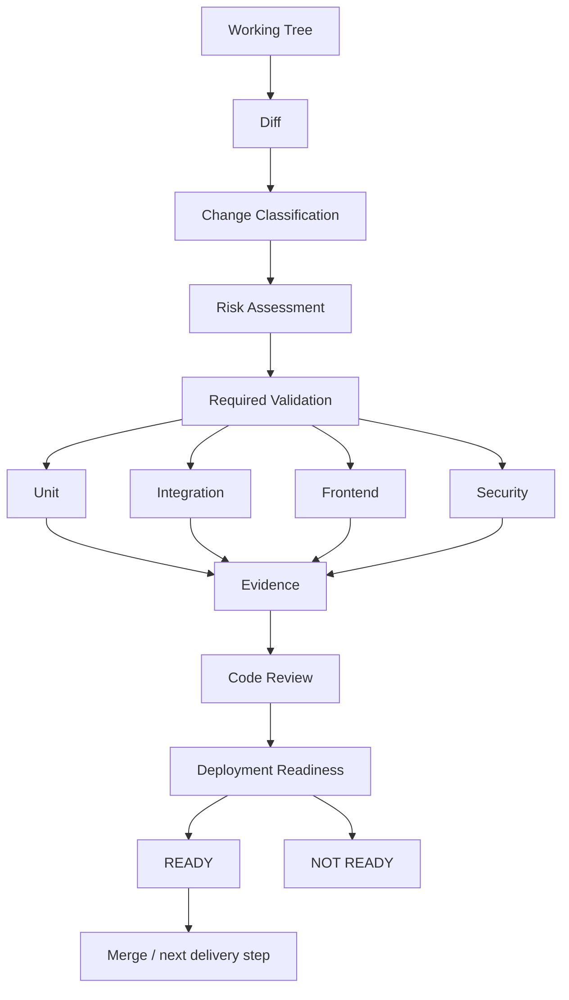

# Change delivery workflow

```mermaid
flowchart TD
    A[Working Tree] --> B[Diff]
    B --> C[Change Classification]
    C --> D[Risk Assessment]
    D --> E[Required Validation]
    E --> U[Unit]
    E --> I[Integration]
    E --> F[Frontend]
    E --> S[Security]
    U --> V[Evidence]
    I --> V
    F --> V
    S --> V
    V --> R[Code Review]
    R --> G[Deployment Readiness]
    G --> Y[READY]
    G --> N[NOT READY]
    Y --> M[Merge / next delivery step]
```

`READY` deliberately does not point to an automatic production deployment.
