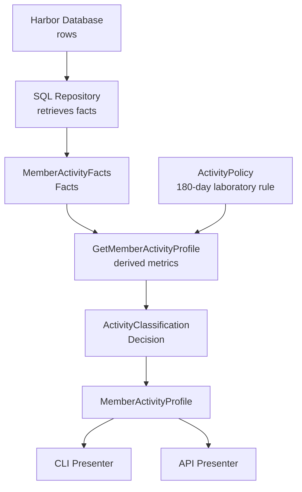

# Data-driven development

```mermaid
flowchart TD
    DB[Harbor Database<br/>rows] --> SQL[SQL Repository<br/>retrieves facts]
    SQL --> F[MemberActivityFacts<br/>Facts]
    F --> S[GetMemberActivityProfile<br/>derived metrics]
    P[ActivityPolicy<br/>180-day laboratory rule] --> S
    S --> C[ActivityClassification<br/>Decision]
    C --> R[MemberActivityProfile]
    R --> CLI[CLI Presenter]
    R --> API[API Presenter]
```

The arrows are boundaries: persistence supplies facts, application policy produces a decision, and presenters only render the Harbor-owned result.
