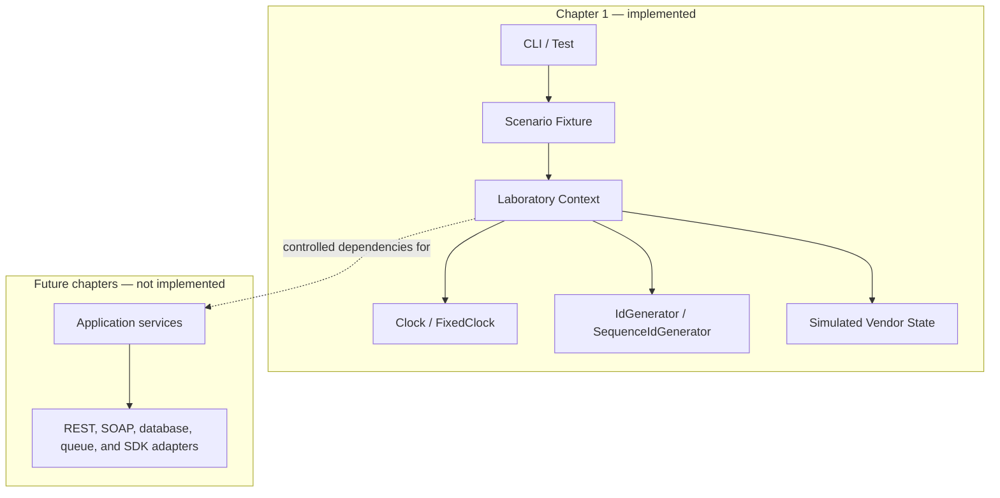

# Deterministic laboratory architecture

Solid lines show the code-backed fixture infrastructure implemented in Chapter 1. The dotted line marks the intended dependency direction for future application services; those services and adapters are not part of this chapter.
