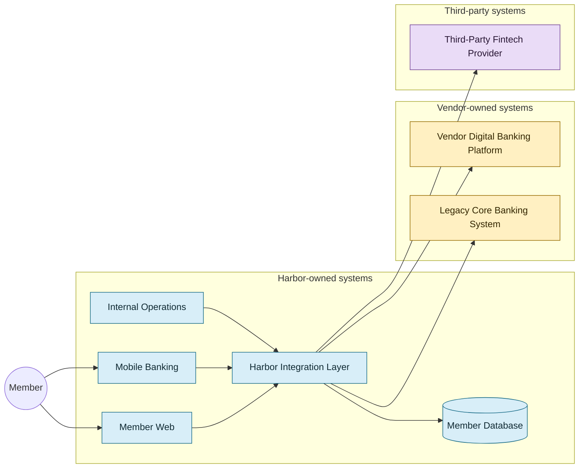

# Harbor digital banking integration ecosystem

This diagram is the fictional architecture used by the laboratory—not a universal reference architecture for financial institutions.

The arrows describe laboratory interactions, not every dependency a production institution would require.
