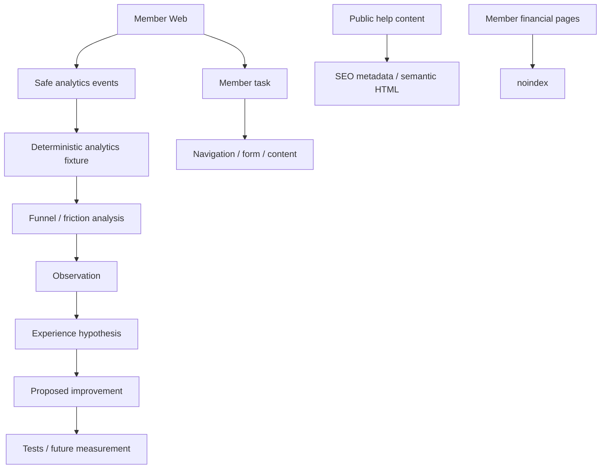

# Digital experience optimization

Analytics describes behavior without reproducing member financial records. Observations identify where to investigate; they do not establish why behavior differs.
