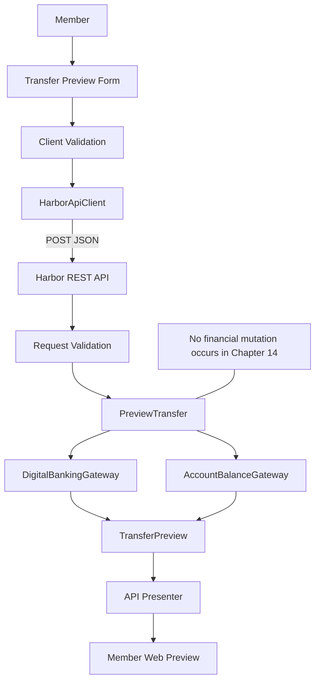

# Digital self-service validation

```mermaid
flowchart TD
  M[Member] --> F[Transfer Preview Form]
  F --> C[Client Validation]
  C --> A[HarborApiClient]
  A -->|POST JSON| R[Harbor REST API]
  R --> V[Request Validation]
  V --> P[PreviewTransfer]
  P --> D[DigitalBankingGateway]
  P --> B[AccountBalanceGateway]
  D --> T[TransferPreview]
  B --> T
  T --> PR[API Presenter]
  PR --> W[Member Web Preview]
  N[No financial mutation occurs in Chapter 14] --- P
```
