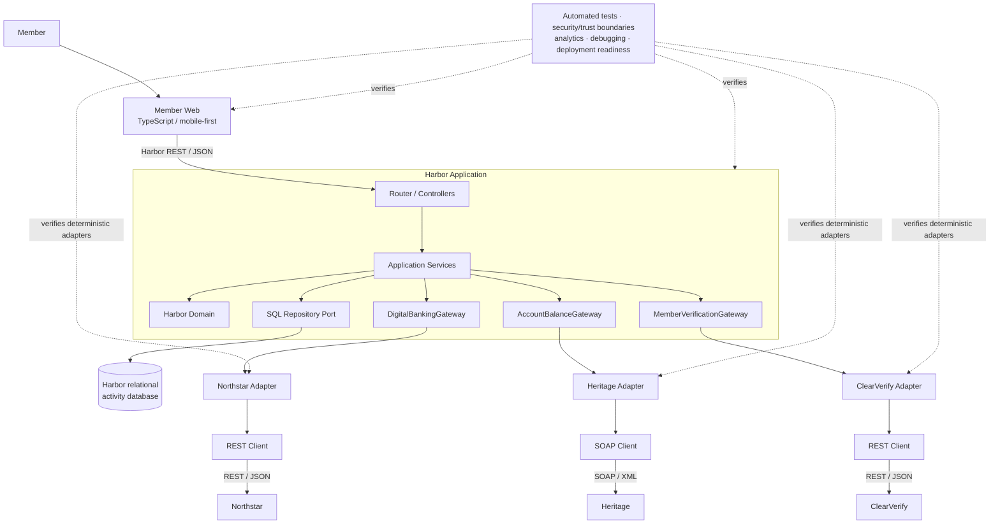

# End-to-End Digital Banking Integration Laboratory

This is the canonical Volume I system map. Chapter concepts remain separate, composable boundaries rather than collapsing into one application.

Chapter 0 establishes the ecosystem; Chapters 2–9 establish domain, ports, transports, adapters, failures, and services; Chapters 10–11 place SQL behind a repository; Chapters 12–17 cover the client and trust/data boundaries; Chapters 18–22 supply testing, debugging, delivery, and analytics controls. Chapter 23 composes those established parts.
