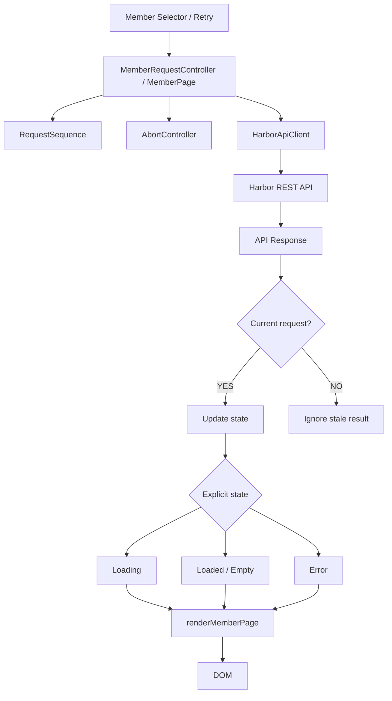

# Frontend request-state architecture

`AbortController` asks obsolete transport work to stop. The current-request check remains the correctness boundary even when a transport ignores cancellation.
