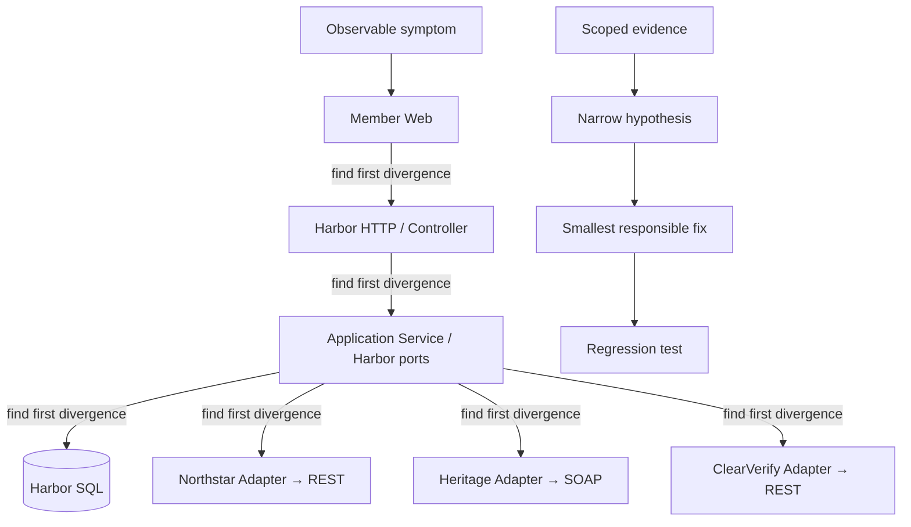

# Full-stack debugging boundaries

```mermaid
flowchart TD
  S[Observable symptom] --> W[Member Web]
  W -->|find first divergence| H[Harbor HTTP / Controller]
  H -->|find first divergence| A[Application Service / Harbor ports]
  A -->|find first divergence| SQL[(Harbor SQL)]
  A -->|find first divergence| N[Northstar Adapter → REST]
  A -->|find first divergence| SOAP[Heritage Adapter → SOAP]
  A -->|find first divergence| CV[ClearVerify Adapter → REST]
  E[Scoped evidence] --> Y[Narrow hypothesis]
  Y --> F[Smallest responsible fix]
  F --> R[Regression test]
```

At every arrow ask: **What did the layer receive? What should it produce? Did it?**
