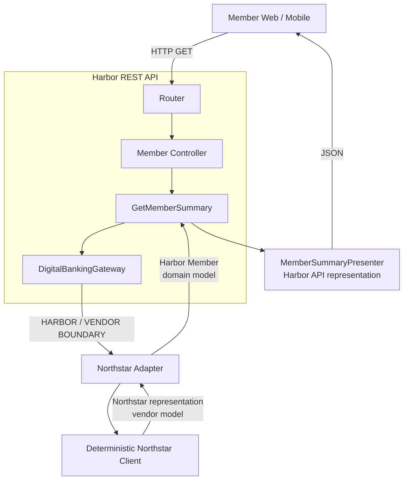

# Harbor REST API boundary

The three representations are deliberately distinct: the client produces a vendor representation, the adapter produces Harbor domain meaning, and the presenter produces Harbor's public API contract.
