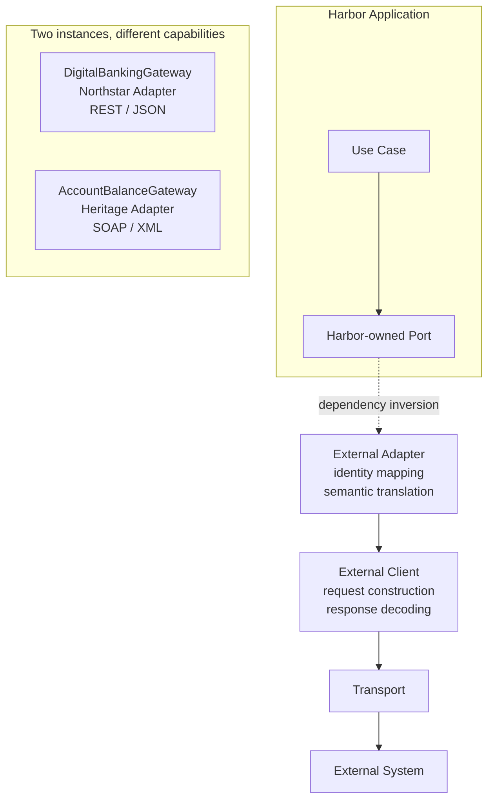

# Integration adapter pattern

The dotted edge emphasizes that the adapter implements the Harbor-owned port: the application does not depend on the concrete adapter. Northstar and Heritage reuse this pattern, not one universal business interface.
