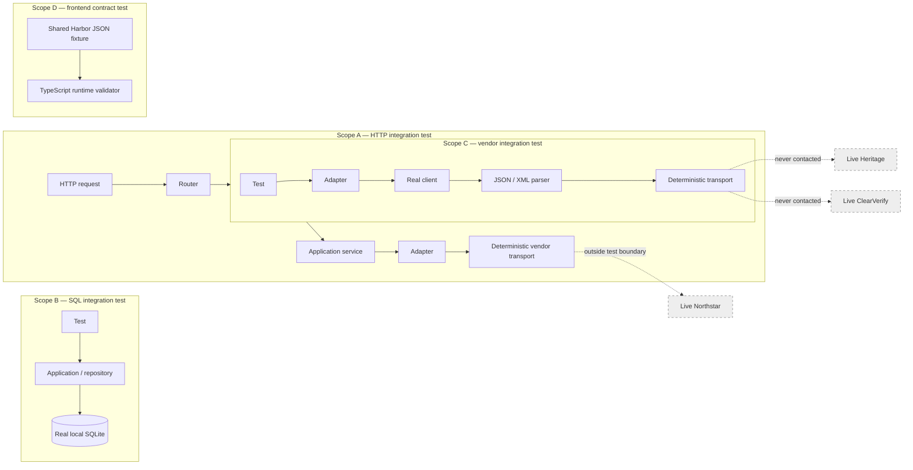

# Integration testing boundaries

The dashed live systems are deliberately outside every Chapter 19 test scope. A deterministic transport makes request construction observable while preventing a live call.
