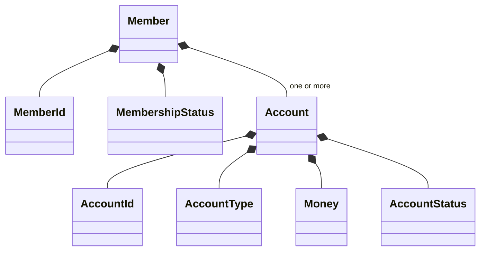
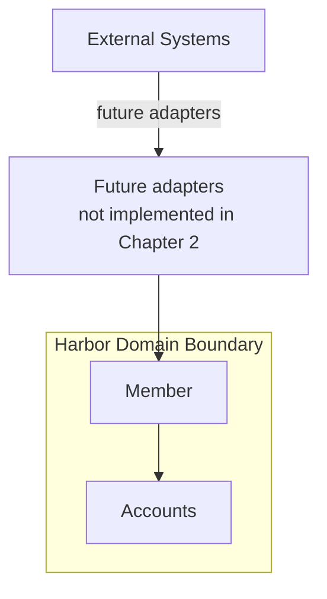

# Member domain model

```mermaid
classDiagram
    Member *-- MemberId
    Member *-- MembershipStatus
    Member *-- "one or more" Account
    Account *-- AccountId
    Account *-- AccountType
    Account *-- Money
    Account *-- AccountStatus
```

```mermaid
flowchart TD
    External[External Systems]
    Future[Future adapters<br/>not implemented in Chapter 2]
    subgraph Boundary[Harbor Domain Boundary]
        Member[Member] --> Accounts[Accounts]
    end
    External -->|future adapters| Future
    Future --> Member
```
