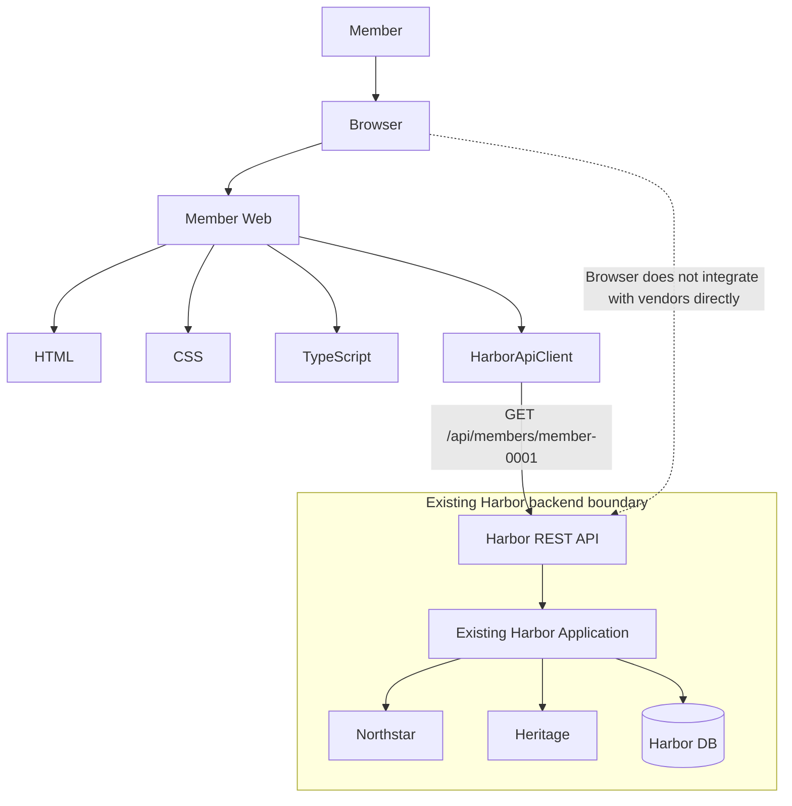

# Member Web experience

```mermaid
flowchart TB
    Member[Member] --> Browser[Browser]
    Browser --> Web[Member Web]
    Web --> HTML[HTML]
    Web --> CSS[CSS]
    Web --> TS[TypeScript]
    Web --> Client[HarborApiClient]
    Client -->|GET /api/members/member-0001| API[Harbor REST API]

    subgraph boundary[Existing Harbor backend boundary]
      API --> Application[Existing Harbor Application]
      Application --> NS[Northstar]
      Application --> Heritage[Heritage]
      Application --> DB[(Harbor DB)]
    end

    Browser -. "Browser does not integrate with vendors directly" .-> API
```

Northstar, Heritage, and Harbor's database remain behind Harbor's backend boundary. Only the Harbor REST representation crosses into the browser.
