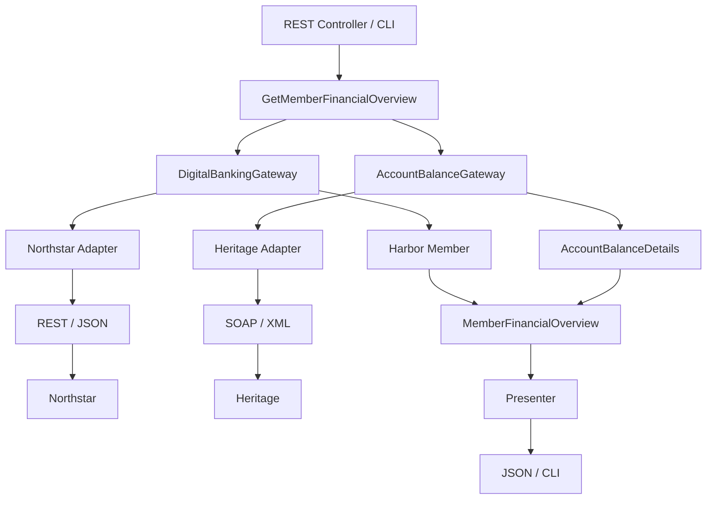

# PHP application orchestration

```mermaid
flowchart TD
    Entry[REST Controller / CLI] --> UseCase[GetMemberFinancialOverview]
    UseCase --> Digital[DigitalBankingGateway]
    UseCase --> Balance[AccountBalanceGateway]
    Digital --> Northstar[Northstar Adapter] --> Rest[REST / JSON] --> NS[Northstar]
    Balance --> Heritage[Heritage Adapter] --> Soap[SOAP / XML] --> HC[Heritage]
    Digital --> Member[Harbor Member]
    Balance --> Details[AccountBalanceDetails]
    Member --> Overview[MemberFinancialOverview]
    Details --> Overview
    Overview --> Presenter[Presenter] --> Output[JSON / CLI]
```

The use case sees only the two Harbor ports and Harbor values. Concrete adapters are selected by the composition root.
