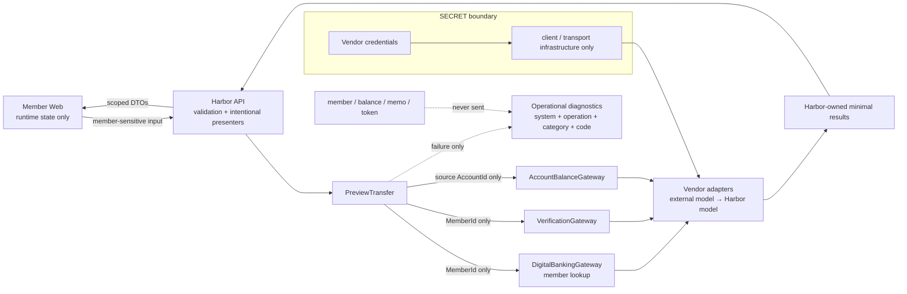

# Sensitive data flow

```mermaid
flowchart LR
    Web[Member Web\nruntime state only] -->|member-sensitive input| API[Harbor API\nvalidation + intentional presenters]
    API --> Preview[PreviewTransfer]
    Preview -->|MemberId only| Digital[DigitalBankingGateway\nmember lookup]
    Preview -->|MemberId only| Verify[VerificationGateway]
    Preview -->|source AccountId only| Balance[AccountBalanceGateway]
    Digital --> Adapters[Vendor adapters\nexternal model → Harbor model]
    Verify --> Adapters
    Balance --> Adapters
    Adapters --> Result[Harbor-owned minimal results]
    Result --> API
    API -->|scoped DTOs| Web

    subgraph Secret[SECRET boundary]
      Credentials[Vendor credentials] --> Transport[client / transport infrastructure only]
    end
    Transport --> Adapters

    Preview -. failure only .-> Events[Operational diagnostics\nsystem + operation + category + code]
    Rejected[member / balance / memo / token] -. never sent .-> Events
```

The dotted rejection edge is descriptive: operational events have explicit fields, not an arbitrary context array.
