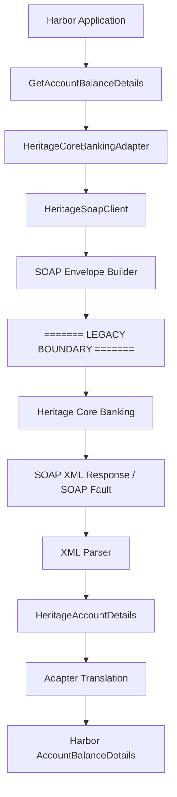
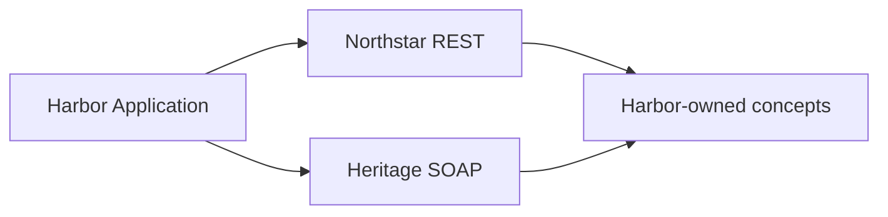

# SOAP legacy integration

```mermaid
flowchart TB
    A[Harbor Application] --> U[GetAccountBalanceDetails]
    U --> AD[HeritageCoreBankingAdapter]
    AD --> C[HeritageSoapClient]
    C --> B[SOAP Envelope Builder]
    B --> L["======= LEGACY BOUNDARY ======="]
    L --> H[Heritage Core Banking]
    H --> R[SOAP XML Response / SOAP Fault]
    R --> P[XML Parser]
    P --> HM[HeritageAccountDetails]
    HM --> T[Adapter Translation]
    T --> HD[Harbor AccountBalanceDetails]
```

```mermaid
flowchart LR
    A[Harbor Application] --> N[Northstar REST]
    A --> H[Heritage SOAP]
    N --> HC[Harbor-owned concepts]
    H --> HC
```
