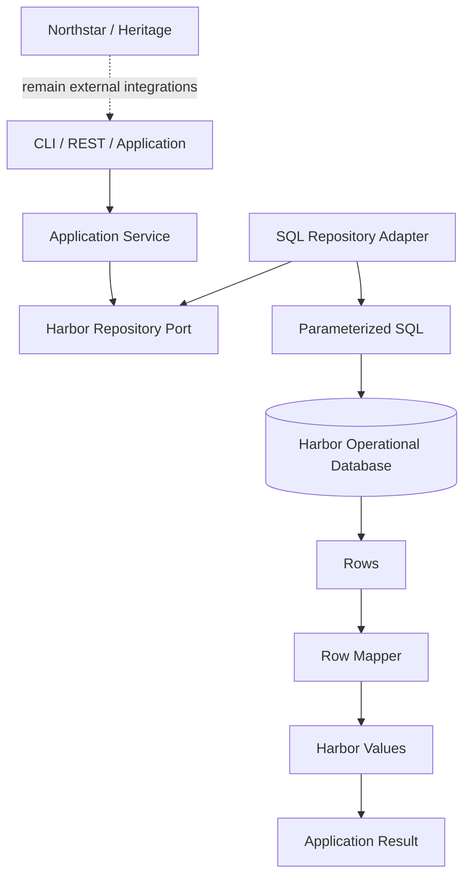

# SQL data-access architecture

```mermaid
flowchart TD
  UI[CLI / REST / Application] --> S[Application Service]
  S --> P[Harbor Repository Port]
  A[SQL Repository Adapter] --> P
  A --> Q[Parameterized SQL]
  Q --> D[(Harbor Operational Database)]
  D --> R[Rows]
  R --> M[Row Mapper]
  M --> V[Harbor Values]
  V --> O[Application Result]
  E[Northstar / Heritage] -. remain external integrations .-> UI
```
