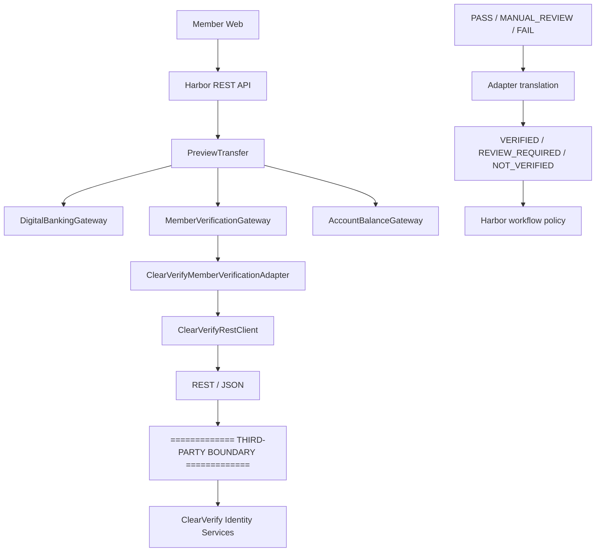

# Third-party fintech integration

```mermaid
flowchart TD
  Web[Member Web] --> API[Harbor REST API]
  API --> Preview[PreviewTransfer]
  Preview --> Digital[DigitalBankingGateway]
  Preview --> Verification[MemberVerificationGateway]
  Preview --> Balance[AccountBalanceGateway]
  Verification --> Adapter[ClearVerifyMemberVerificationAdapter]
  Adapter --> Client[ClearVerifyRestClient]
  Client --> Wire[REST / JSON]
  Wire --> Boundary["============= THIRD-PARTY BOUNDARY ============="]
  Boundary --> CV[ClearVerify Identity Services]
  Vendor["PASS / MANUAL_REVIEW / FAIL"] --> Translate[Adapter translation]
  Translate --> Harbor["VERIFIED / REVIEW_REQUIRED / NOT_VERIFIED"]
  Harbor --> Policy[Harbor workflow policy]
```

Only the adapter translates provider vocabulary. The browser and API receive Harbor-owned meaning.
