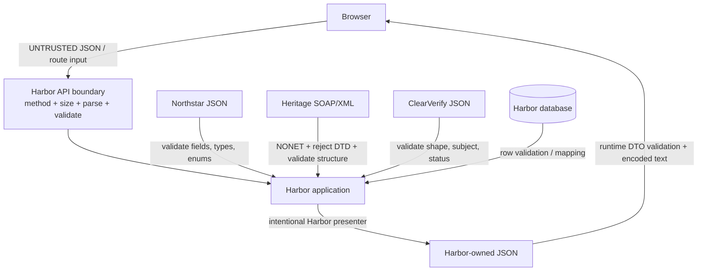

# Harbor trust boundaries

```mermaid
flowchart TD
  Browser[Browser] -->|UNTRUSTED JSON / route input| Api[Harbor API boundary<br/>method + size + parse + validate]
  Api --> App[Harbor application]
  Northstar[Northstar JSON] -->|validate fields, types, enums| App
  Heritage[Heritage SOAP/XML] -->|NONET + reject DTD + validate structure| App
  ClearVerify[ClearVerify JSON] -->|validate shape, subject, status| App
  Database[(Harbor database)] -->|row validation / mapping| App
  App -->|intentional Harbor presenter| PublicJson[Harbor-owned JSON]
  PublicJson -->|runtime DTO validation + encoded text| Browser
```

Arrows identify data movement, not inherited trust. Each receiving adapter owns validation before translation or use.
