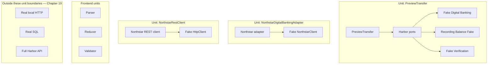

# Unit-testing boundaries

The replaced collaborator belongs immediately across the meaningful boundary. Replacing every class between the unit and the outside world would hide, rather than clarify, the architecture.
