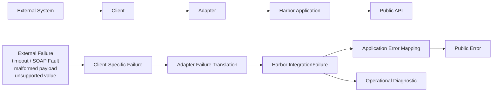

# Vendor failure handling

The upper path is unchanged success behavior. The lower path contains vendor vocabulary at the adapter and then branches Harbor-owned meaning into a member-safe contract and internal engineering evidence.
