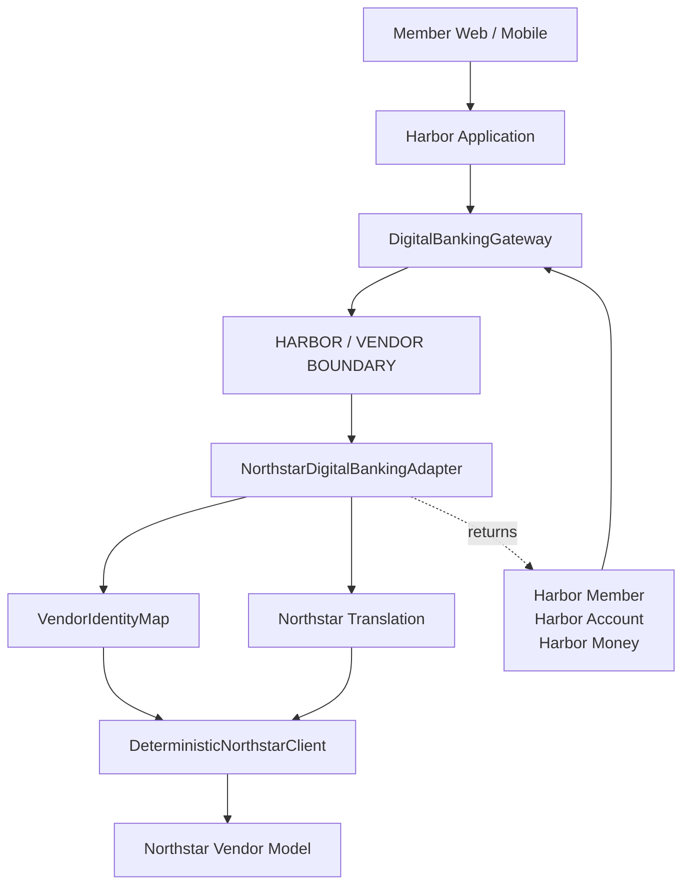

# Vendor platform boundary

```mermaid
flowchart TD
    Channels[Member Web / Mobile] --> App[Harbor Application]
    App --> Gateway[DigitalBankingGateway]
    Gateway --> Boundary[HARBOR / VENDOR BOUNDARY]
    Boundary --> Adapter[NorthstarDigitalBankingAdapter]
    Adapter --> Map[VendorIdentityMap]
    Adapter --> Translation[Northstar Translation]
    Map --> Client[DeterministicNorthstarClient]
    Translation --> Client
    Client --> Models[Northstar Vendor Model]
    Adapter -. returns .-> Harbor[Harbor Member<br/>Harbor Account<br/>Harbor Money]
    Harbor --> Gateway
```

Northstar keys, classes, states, and customer terminology remain below the boundary. Only Harbor domain values return through the Harbor-owned gateway.
