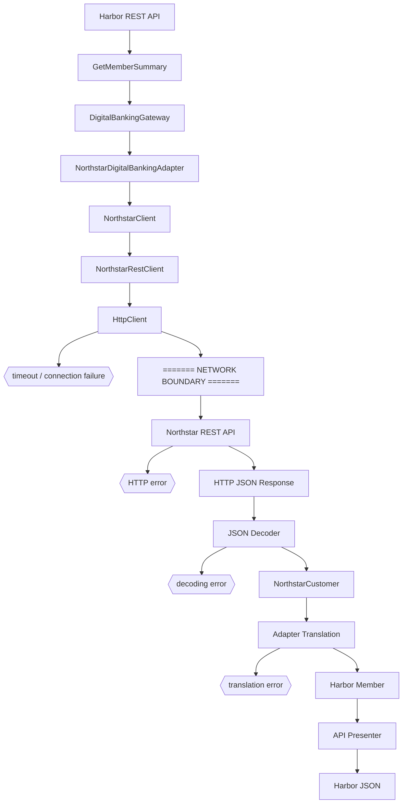

# Vendor REST integration

The deterministic `HttpClient` occupies the network seam in the laboratory. It returns explicit fixtures or immediately raises a classified failure; it never performs DNS or opens a socket.
